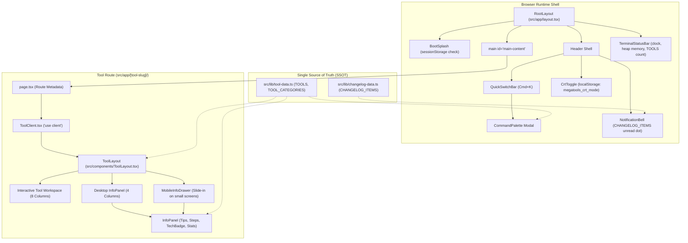

# System Architecture & Shell Overview

MegaTools is an in-browser suite of developer, cryptographic, security, multimedia, and Web3 utilities built on the Next.js App Router. Unlike traditional multi-tool platforms that rely on server-side processing pipelines or microservice APIs, MegaTools enforces a strict client-only architecture: 100% of data manipulation, cryptographic hashing, key generation, document processing, and formatting runs inside the user's browser runtime.

No user-supplied payloads, keys, images, or documents leave the local device. The application delivers native CLI-inspired ergonomics, terminal-themed UI patterns, and uniform layout integration across all tool suites.

---

## Architectural Composition & Hierarchy

MegaTools structures its layout hierarchy to guarantee consistent UX, unified navigation, automated metadata rendering, and responsive adaptability across desktop and mobile screens.


*Application composition and layout wrapping hierarchy from the root shell down to individual tool layouts and the central data registry.*

---

## Client-Side Next.js App Router Architecture

The frontend uses Next.js 16 and React 19. The application root defines global styling, fonts, and the persistent shell, while tool routes host dedicated interactive workspaces.

### 1. Root Layout (`src/app/layout.tsx`)

`RootLayout` wraps every view rendered by the application:
- **Font Configuration**: Configures `--font-geist-sans`, `--font-geist-mono`, and `--font-jetbrains-mono` for typography.
- **Boot Sequence**: Injects `<BootSplash />` to simulate terminal initialization.
- **Accessibility**: Includes a high-priority "Skip to main content" anchor (`#main-content`) styled for keyboard navigation.
- **Top Header**: Hosts the project logo (`[megatools]$`), `<QuickSwitchBar />` (which encapsulates `<ToolsDropdown />` and the `<CommandPalette />` trigger), `<CrtToggle />`, and `<NotificationBell />`.
- **Structured Data**: Injects a `WebApplication` JSON-LD schema declaring application category, zero-cost offer, and platform independence.
- **Persistent Status & Footer**: Mounts `<TerminalStatusBar />` right below `<main>` followed by the project footer containing crypto contribution addresses and policy links.

### 2. Standardized Tool Shell (`src/components/ToolLayout.tsx`)

Every individual utility route delegates its rendering structure to `<ToolLayout />`:

```tsx
import ToolLayout from "@/components/ToolLayout";

export default function ExampleToolClient() {
  const stats = (
    <div className="space-y-1 text-xs font-mono">
      <div className="flex justify-between items-center py-1 border-b border-border-subtle/50">
        <span className="text-text-muted">Status:</span>
        <span className="text-accent font-bold">Ready</span>
      </div>
    </div>
  );

  return (
    <ToolLayout toolId="example-slug" stats={stats}>
      <div className="rounded-xl border border-border-subtle bg-bg-card p-4">
        {/* Workspace Implementation */}
      </div>
    </ToolLayout>
  );
}
```

#### Responsibilities of `<ToolLayout />`:
1. **Breadcrumb & Mobile Trigger**: Displays `← [cd .. / home]` linking back to `/`, plus a `[?] Tool Info` button on viewports smaller than `lg` (1024px).
2. **Terminal Badge & Heading**: Renders `$ megatools --<tool-slug> --client-side` accompanied by a pulsing green cursor (`animate-pulse`). Parses the tool title to automatically apply the accent color to the penultimate word.
3. **12-Column Responsive Workspace Grid**:
   - **Main Workspace (`lg:col-span-8`)**: Renders the tool's core interactive UI passed via `children`.
   - **Desktop Sidebar (`hidden lg:block lg:col-span-4`)**: Renders `<InfoPanel toolId={toolId} stats={stats} />`.
4. **Mobile Info Drawer**: Integrates `<MobileInfoDrawer />` to host `<InfoPanel />` when toggled on mobile viewports.

### 3. Info Panel & Mobile Drawer (`InfoPanel.tsx` & `MobileInfoDrawer.tsx`)

- **`<InfoPanel />` (`src/components/InfoPanel.tsx`)**: Queries `getToolInfo(toolId)` from `src/lib/tool-data.ts`. It renders a header with `<TechBadge tech={tool.tech} />`, an ordered "How to Use" step guide, an optional live `stats` block passed by the tool client, a bulleted list of "Tips", and an interactive "Example" card with input/output fields and an instant `<CopyButton />`.
- **`<MobileInfoDrawer />` (`src/components/MobileInfoDrawer.tsx`)**: Provides an off-canvas drawer (`fixed right-0 top-0 z-50 h-full w-80`) with a dark backdrop (`bg-black/60`). When `open` is true, an effect hook sets `document.body.style.overflow = "hidden"` to prevent background scrolling.

---

## Single Source of Truth: Registry & Metadata

MegaTools decouples tool business logic from site-wide directory registration through static configuration files.

### 1. Tool Metadata Registry (`src/lib/tool-data.ts`)

`tool-data.ts` acts as the primary registry for the entire platform:
- **`TOOLS: ToolInfo[]`**: Exhaustive list defining every tool's schema:
  - `id`: Unique slug matching the route folder under `src/app/<slug>`.
  - `title` & `shortTitle`: Full display name and abbreviated badge label.
  - `description`: Plain-text explanation of functionality.
  - `emoji`: Visual glyph used in navigation dropdowns and cards.
  - `href`: Root-relative route (e.g., `/aes-crypto`).
  - `tech`: Underlying web technology or algorithm (e.g., `WebCrypto API`, `Canvas API`, `pdf-lib`).
  - `steps`: Step-by-step usage instructions.
  - `tips`: Operational guidance and best practices.
  - `example`: Optional `{ input: string; output: string }` demonstration payload.
- **`TOOLS_INFO: Record<string, ToolInfo>`**: Dictionary generated via `Object.fromEntries(TOOLS.map(t => [t.id, t]))` to enable $O(1)$ lookups through `getToolInfo(toolId)`.
- **`TOOL_CATEGORIES: ToolCategory[]`**: Defines thematic groupings (`pdf-docs`, `crypto-security`, `media-qr`, `format-text`, `dev-network`, `blockchain-web3`, `ai-llm`). Each category contains a `toolIds` array.

#### Dual-Registration Invariant
Every tool registered in `TOOLS` must have its `id` listed in the `toolIds` array of exactly one category in `TOOL_CATEGORIES`. If an id is missing from `TOOL_CATEGORIES`, the tool is omitted from the homepage category filter tabs and the top `<ToolsDropdown />`.

### 2. Changelog Registry (`src/lib/changelog-data.ts`)

`CHANGELOG_ITEMS` stores all platform release history:
- Schema: `{ id, date, title, type, toolHref?, toolName?, description, highlights? }`.
- `type` accepts `"added" | "updated" | "improved" | "fixed"`.
- Ordering: New entries must be prepended to the top of `CHANGELOG_ITEMS` using valid ISO date strings (`YYYY-MM-DD`).

### 3. Dynamic Sitemap (`src/app/sitemap.ts`)

The sitemap generator maps dynamically over `TOOLS`:
```ts
const pages = ["", "/about", "/changelog", "/privacy", "/terms", ...TOOLS.map((t) => t.href)];
```
Whenever a new tool is appended to `TOOLS`, it is automatically incorporated into `/sitemap.xml` with zero manual routing maintenance.

---

## Global Shell Features & Systems

MegaTools provides specialized shell utilities that reinforce its CLI and terminal identity while preserving performance.

### 1. Command Palette (`src/components/CommandPalette.tsx`)

The command palette provides instant fuzzy-like search across all tools:
- **Invocation**: Triggered from `<QuickSwitchBar />` or globally via `Cmd+K` (macOS/iOS) or `Ctrl+K` (Linux/Windows). Platform detection uses `navigator.userAgent` via `useSyncExternalStore`.
- **Filtering**: Filters `TOOLS` against `title`, `shortTitle`, `description`, `tech`, and `href`.
- **Keyboard Navigation**: Uses a capture-phase listener (`window.addEventListener("keydown", handleKeyDown, true)`):
  - `Escape`: Closes palette immediately.
  - `ArrowDown` / `ArrowUp`: Cycles through matching tools with active-element auto-scroll (`scrollIntoView({ block: "nearest" })`).
  - `Enter`: Routes directly to the selected tool via Next.js `useRouter().push(tool.href)`.

### 2. BIOS Boot Splash (`src/components/BootSplash.tsx`)

On initial visit during a browser session, `<BootSplash />` runs an authentic ASCII boot routine:
- **Session Check**: Checks `sessionStorage.getItem("megatools_booted")`. If unrecorded, marks it as `"true"` and launches the log sequence.
- **Log Stream**: Emits mock kernel messages at 45ms intervals across 10 steps (verifying WebCrypto, sandboxed memory heaps, airgapped loopback, and mounting binary packages).
- **Dismissal**: Users can skip instantly via `Escape`, `Enter`, `Space`, or mouse click.
- **Reboot Hook**: Listens for the custom DOM event `megatools:reboot` (`window.addEventListener("megatools:reboot", handleReboot)`), allowing users to replay the sequence on demand.

### 3. Retro CRT Scanline Filter (`src/components/CrtToggle.tsx`)

Provides a toggleable retro cathode-ray tube aesthetic:
- **Persistence**: Reads and writes state to `localStorage` under `megatools_crt_mode` (`"true"` | `"false"`).
- **DOM Activation**: Dynamically adds or removes the `.crt-active` class on `document.documentElement` (`<html>`).
- **Styling Architecture (`src/app/globals.css`)**:
  - `html.crt-active`: Injects green phosphor text glow: `text-shadow: 0 0 1.5px rgba(74, 222, 128, 0.4)`.
  - `html.crt-active::after`: Injects a fixed, pointer-events-disabled raster overlay with horizontal 3px scanline gradients (`rgba(0, 0, 0, 0.25)`) and vertical subpixel chromatic aberrations (`z-index: 999999`).

### 4. Notification Bell (`src/components/NotificationBell.tsx`)

Located in the top header, the notification bell monitors new updates:
- **Unread Evaluation**: Compares `CHANGELOG_ITEMS[0]?.id` against `localStorage.getItem("megatools_last_seen_changelog")`.
- **Badge Indicator**: Displays a pulsing green unread dot when a newer changelog entry exists.
- **Popover Feed**: When opened, renders the 15 most recent changelog entries with colored badges (`added` = green, `updated` = amber, `improved` = emerald, `fixed` = red).
- **Read Acknowledgment**: Opening the popover writes the latest entry ID into `localStorage` and dismisses the unread state. Clicking outside or pressing `Escape` closes the popover.

### 5. Terminal Status Bar (`src/components/TerminalStatusBar.tsx`)

Fixed at the bottom of the viewport above the footer:
- **Tmux Session Control**: Renders `[0:megatools*]`. Clicking this button dispatches `window.dispatchEvent(new Event("megatools:reboot"))` to replay the BIOS boot sequence.
- **System Isolation Badge**: Confirms `SYS: ISOLATED_SANDBOX`.
- **Module Count**: Dynamically reads `TOOLS.length` to report `MODULES: <count> PKGS`.
- **Hardware Telemetry**:
  - **Memory**: Checks `performance.memory.usedJSHeapSize` (in Chromium browsers) and displays `HEAP: <MB>MB`.
  - **Latency**: Displays `LATENCY: 0.0ms` to communicate local client computation.
  - **Clock**: Maintains a live UTC timestamp (`YYYY-MM-DD HH:MM:SS UTC`) refreshed every second via `setInterval`.

---

## Automated Verification & Quality Gates

MegaTools incorporates an automated verification script to maintain architectural invariants.

### Workflow Validator (`scripts/verify-workflow.mjs`)

Executed via `npm run verify`, this script executes three checks before deployment:

| Gate | Target | Validation Criterion |
|---|---|---|
| **1. Layout Adoption** | `src/app/**/page.tsx` & `*Client.tsx` | Asserts 100% of tool directories (excluding `about`, `privacy`, `terms`, `changelog`) import and wrap their client component with `<ToolLayout />`. |
| **2. Category Synchronization** | `src/lib/tool-data.ts` | Performs bidirectional validation: every ID in `TOOLS` must exist in `TOOL_CATEGORIES`, and no nonexistent IDs may exist in `TOOL_CATEGORIES`. |
| **3. Changelog Integrity** | `src/lib/changelog-data.ts` | Asserts `CHANGELOG_ITEMS` is non-empty and validates that every date matches the strict ISO format `^\d{4}-\d{2}-\d{2}$`. |

### Scaffolding New Tools

To prevent manual registration drift, new tools must be scaffolded using the built-in generator:
```bash
npm run make:tool <slug> "<Title>" <category> "<Tech>"
```
This script scaffolds `src/app/<slug>/page.tsx` and `src/app/<slug>/<Name>Client.tsx` with `<ToolLayout />` pre-configured, appends the tool record to `TOOLS`, and injects the slug into `TOOL_CATEGORIES`.
