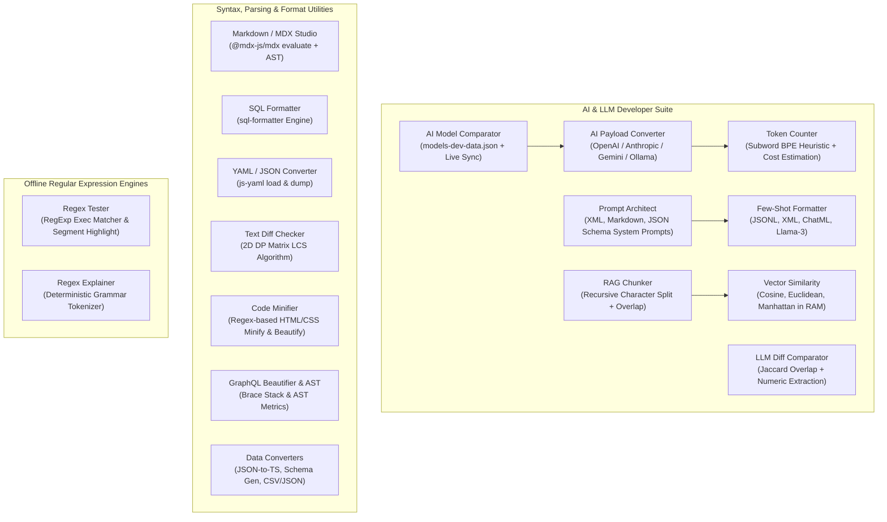
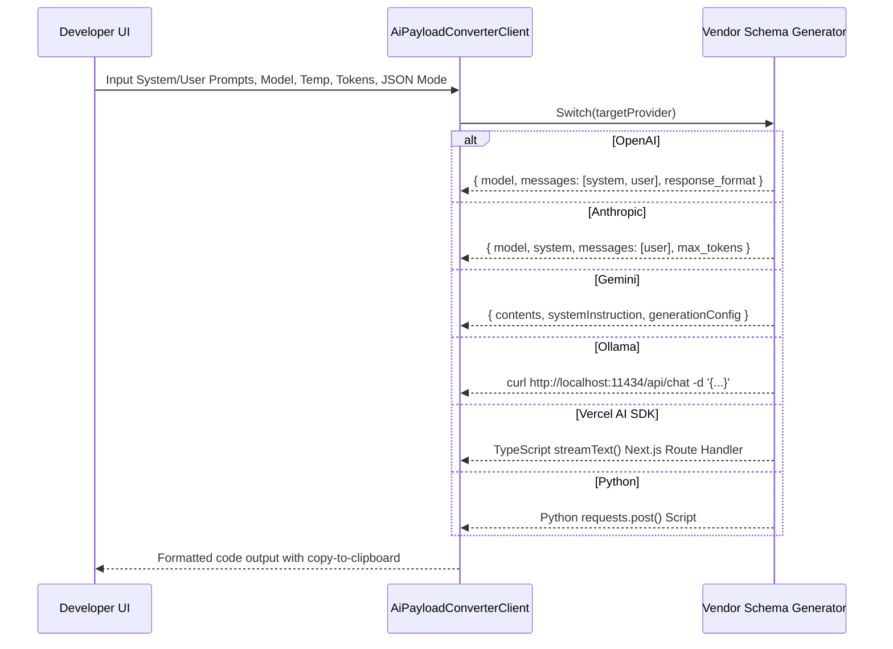
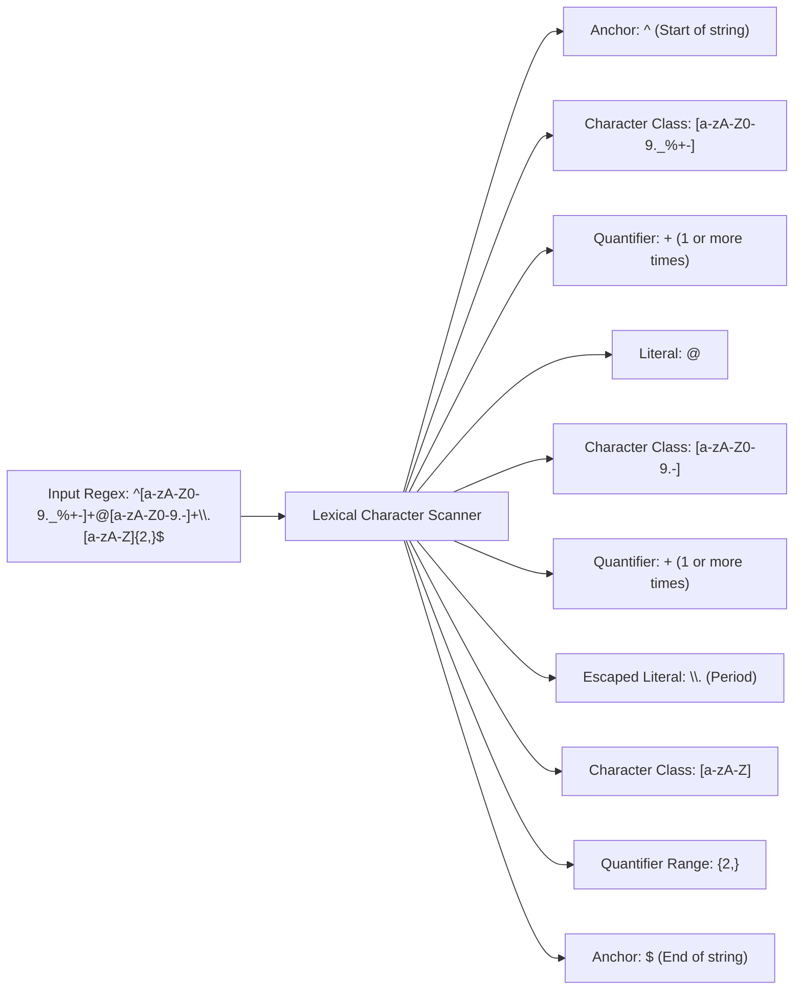

# AI, LLM, and Code Utilities

MegaTools hosts a dedicated suite of browser-native AI/LLM developer utilities and source text manipulation engines. Every tool in this family complies strictly with the zero-server-leakage architectural guarantee: all prompt synthesis, vector mathematics, payload conversions, syntax AST compilations, diff comparisons, and regular expression evaluations execute directly inside client browser memory (V8/JavaScript engine) with zero API proxying or telemetry exfiltration.


*Functional architecture and grouping of AI, LLM, syntax formatting, and regex utilities.*

---

## 1. AI & LLM Developer Utilities

The `ai-llm` category provides engineering utilities designed to prepare, tokenize, translate, compare, and benchmark inputs and outputs for Large Language Models.

### AI Model Comparator

- **Entrypoint**: `src/app/ai-model-comparator/AiModelComparatorClient.tsx`
- **Data Catalog**: Bundled static database in `src/lib/models-dev-data.json` containing comprehensive catalog schemas for frontier models (OpenAI, Anthropic, DeepSeek, Google Gemini, Qwen, GLM, Mistral, MiniMax, HPC-AI, AI-Router, and Cloudflare Workers AI).
- **Offline Fallback & Cache Hydration**: On component mount, the client reads cached catalog data from browser `localStorage` under the key `megatools_models_dev_raw`. If unavailable, it falls back instantly to the bundled `RAW_MODELS_DEV_DATA` JSON payload.
- **Optional Direct Sync**: Users can manually trigger `handleSyncModelsDev()` which issues an HTTP GET request directly from the browser to `https://models.dev/api.json`. Upon successful fetch, the updated JSON is written to `localStorage` and component state is refreshed, maintaining an offline-first contract with live-refresh capability.
- **Cost & Constraint Projection**: Evaluates dynamic prompt costs using the formula:
  $$\text{Cost} = \left(\frac{\text{Input Tokens}}{10^6} \times \text{Cost}_{\text{input}}\right) + \left(\frac{\text{Output Tokens}}{10^6} \times \text{Cost}_{\text{output}}\right)$$
  Supports sorting across 11 distinct attributes (`name`, `provider`, `context`, `output_limit`, `input`, `output`, `cache_read`, `cache_write`, `est_cost`, `knowledge`, `release_date`) and filtering by capability toggles (`reasoning`, `vision`, `tools`, `structured`, `open_weights`).

### AI Payload Converter

- **Entrypoint**: `src/app/ai-payload-converter/AiPayloadConverterClient.tsx`
- **Multi-Vendor Translation**: Translates prompt configurations and inference parameters across major model schema targets:
  - **OpenAI (`openai`)**: Generates Chat Completion format with structured `messages: [{ role: "system", content }, { role: "user", content }]`, `temperature`, `max_tokens`, and optional `response_format: { type: "json_object" }`.
  - **Anthropic (`anthropic`)**: Extracts system instructions to a top-level `system` property and structures conversational turns under `messages: [{ role: "user", content }]`, defaulting to Claude 3.7 / 3.5 models.
  - **Google Gemini (`gemini`)**: Maps prompts to `contents: [{ role: "user", parts: [{ text }] }]` and top-level `systemInstruction: { parts: [{ text }] }`, configuring `generationConfig` with `maxOutputTokens` and `responseMimeType: "application/json"`.
  - **Ollama (`ollama`)**: Formats an executable local `curl` CLI invocation targeting `http://localhost:11434/api/chat` with `num_predict` options.
  - **Vercel AI SDK (`vercel-ai`)**: Generates executable Next.js route handler code utilizing `streamText()` from the `ai` package and `@ai-sdk/openai`.
  - **Python Requests (`python`)**: Generates runnable Python boilerplate invoking the standard `requests.post()` interface with Bearer token authentication headers.


*Schema generation pipeline for multi-vendor AI payload conversion.*

### Prompt Architect

- **Entrypoint**: `src/app/prompt-architect/PromptArchitectClient.tsx`
- **Structured Instruction Modeling**: Manages prompt engineering structures including persona role definition, context boundaries, dynamic guardrails/constraints, output formatting rules, fallback protocols, and few-shot examples.
- **Multimodal Serialization Modes**:
  - `xml`: Wraps sections in Anthropic-recommended XML tags (`<instructions>`, `<role>`, `<context>`, `<constraints>`, `<output_format>`, `<fallback_rules>`, `<examples>`).
  - `markdown`: Formats into hierarchical Markdown sections (`# SYSTEM INSTRUCTIONS`, `## Role & Persona`, `## Guardrails & Constraints`, etc.).
  - `json`: Assembles OpenAI-compatible Chat Completion message envelopes with embedded guardrail annotations.

### RAG Chunker

- **Entrypoint**: `src/app/rag-chunker/RagChunkerClient.tsx`
- **Recursive Character Splitting Algorithm**: Implements a recursive splitting routine that cycles through natural hierarchical delimiters: `["\n\n", "\n", ". ", " ", ""]`.
- **Sliding Overlap Window**: To preserve relational semantic context across boundaries, chunks retain an overlap buffer derived from the trailing characters of the preceding segment. The client bounds the overlap buffer via `Math.min(overlap, Math.floor(chunkSize * 0.5))` to guarantee that overlap never consumes more than 50% of any chunk.
- **Client Processing & Export**: Generates indexed chunk cards alongside a structured JSON export containing chunk indices, character counts, and token estimates ready for vector database ingestion (Pinecone, Milvus, Qdrant).

### Token Counter

- **Entrypoint**: `src/app/token-counter/TokenCounterClient.tsx`
- **Subword BPE Heuristic Engine**: Evaluates text density using an offline regex subword tokenizer: `/\s+|[a-zA-Z0-9_]+|[^\s\w]/g`. Alphanumeric sequences exceeding 5 characters are divided into 4-character subword slices, accurately matching Byte-Pair Encoding (BPE) distributions without loading massive token vocabulary tensors into the client.
- **Interactive Multi-Model Cost Analysis**: Simultaneously compares calculated token counts against provider pricing matrices (GPT-4o, GPT-4o-mini, Claude 3.5 Sonnet, Claude 3.5 Haiku, Gemini 1.5 Pro, Gemini 1.5 Flash, DeepSeek R1, Llama 3.1 70B), computing projected input and output costs in real time.

### LLM Diff Comparator

- **Entrypoint**: `src/app/llm-diff-comparator/LlmDiffComparatorClient.tsx`
- **Jaccard Semantic Overlap**: Computes tokenized bag-of-words similarity between two model completions:
  $$J(A, B) = \frac{|A \cap B|}{|A \cup B|} \times 100$$
- **Numerical & Fact Discrepancy Extractor**: Scans outputs using regular expressions matching currency, percentage, and floating-point figures (`/\b\d+(?:\.\d+)?%?|\$\d+(?:\.\d+)?(?:\s*(?:billion|million|trillion|k|b|m))?\b/gi`). Cross-checks numerical assertions across outputs $A$ and $B$, highlighting hallucinations, conflicting statistics, or altered drug/financial quantities.
- **Visual Modes**: Provides three inspection modes: Side-by-Side Editor, Line Diff Comparator, and Discrepancy Matrix.

### Vector Similarity & Few-Shot Formatter

- **Vector Similarity (`src/app/vector-similarity/VectorSimilarityClient.tsx`)**: Parses arbitrary N-dimensional floating-point vectors from delimited strings, computes vector norms ($\|A\|$, $\|B\|$), Dot Product ($A \cdot B$), Cosine Similarity, Cosine Distance ($1 - \text{sim}$), Euclidean Distance ($\sqrt{\sum (a_i - b_i)^2}$), and Manhattan Distance ($\sum |a_i - b_i|$) directly in JavaScript memory.
- **Few-Shot Formatter (`src/app/few-shot-formatter/FewShotFormatterClient.tsx`)**: Converts input-output demonstration pairs into standardized fine-tuning or few-shot formats: OpenAI JSONL (with configurable system message per row), Anthropic XML `<examples>`, ChatML (`<|im_start|>user ... <|im_end|>`), Llama-3 special token formatting, TypeScript arrays, and CSV.

---

## 2. Formatting, Parsing, and Transformation Utilities

MegaTools integrates specialized formatting, minification, and transpilation engines designed for code bases and structured documents.

### SQL Formatter

- **Entrypoint**: `src/app/sql-formatter/SqlFormatterClient.tsx`
- **Core Engine**: Powered by the npm dependency `sql-formatter` (`^15.8.2`).
- **Dialect Support**: Exposes formatters for standard SQL, PostgreSQL, MySQL, SQLite, Transact-SQL (T-SQL), and BigQuery.
- **Formatting Options**: Supports customizable indentation (`tabWidth`), case transformation for SQL keywords (`upper`, `lower`, `preserve`), and a high-speed Minify mode that strips line comments (`--`), block comments (`/* ... */`), and collapses redundant whitespace.

### YAML / JSON Converter

- **Entrypoint**: `src/app/yaml-json/YamlJsonClient.tsx`
- **Core Engine**: Powered by `js-yaml` (`^5.4.1`) utilizing `load()` for YAML parsing and `dump()` for serialization.
- **Bidirectional In-Memory Pipeline**:
  - `yaml2json`: Ingests YAML text, parses it into native JavaScript heap objects, and serializes to formatted JSON via `JSON.stringify(parsed, null, indent)`.
  - `json2yaml`: Validates input with `JSON.parse()` and dumps to YAML syntax respecting configured indent depth.
- **Failure Resilience**: Syntax syntax errors (e.g. invalid tab characters in YAML or unclosed braces in JSON) are caught within try/catch blocks and surfaced to UI warning banners without crashing the component state.

### Markdown & MDX Studio

- **Entrypoint**: `src/app/markdown-preview/MarkdownClient.tsx`
- **Core Engine**: Powered by `@mdx-js/mdx` (`^3.1.1`) and `react/jsx-runtime`.
- **Client-Side Compilation & Evaluation**: MDX strings are compiled to an executable React component in the browser using `evaluate()`:
  ```tsx
  const cleanCode = sanitizeHtml(code);
  const exports = await evaluate(cleanCode, {
    ...runtime,
    baseUrl: typeof window !== "undefined" ? window.location.href : undefined,
  });
  return { Content: exports.default, error: null };
  ```
- **XSS Sanitization Defense**: Prior to MDX parsing, raw markup passes through `sanitizeHtml()` which strips `<script>` tags, inline `on*` event handlers, and `javascript:` pseudo-protocol URIs to neutralize script injection.

### Text Diffing via LCS Algorithm

- **Entrypoint**: `src/app/text-diff/DiffClient.tsx`
- **Longest Common Subsequence (LCS) Algorithm**: Implements line-by-line diffing using a dynamic programming matrix:
  ```typescript
  const dp: number[][] = Array.from({ length: m + 1 }, () => Array(n + 1).fill(0));
  for (let i = 1; i <= m; i++) {
    for (let j = 1; j <= n; j++) {
      if (origLines[i - 1] === modLines[j - 1]) {
        dp[i][j] = dp[i - 1][j - 1] + 1;
      } else {
        dp[i][j] = Math.max(dp[i - 1][j], dp[i][j - 1]);
      }
    }
  }
  ```
- **Backtracking Reconstruction**: Traverses the DP matrix backwards from `(m, n)` to `(0, 0)`, emitting typed diff tokens (`same`, `add`, `del`) with corresponding line numbers for side-by-side or unified diff rendering.

### Code Minifiers and Beautifiers

- **Entrypoint**: `src/app/code-minifier/CodeMinifierClient.tsx`
- **HTML Engine**:
  - Minifier: Strips HTML comments (`<!-- ... -->`), eliminates inter-tag spacing (`> <` $\to$ `><`), and collapses whitespace runs.
  - Beautifier: Tokenizes opening, closing, and self-closing tags (accounting for void tags such as ``, `<input>`, `<meta>`, `<br>`), dynamically managing indentation depth.
- **CSS Engine**:
  - Minifier: Removes multi-line comments (`/* ... */`), collapses spaces around punctuation `[{:;,>+~}]`, and removes trailing semicolons before closing braces.
  - Beautifier: Minifies input first to standardize tokens, then introduces line breaks and block indentation around `{`, `}`, and `;`.

### AST and Syntax Utilities

- **GraphQL Query Beautifier & AST Inspector (`src/app/graphql-formatter/GraphqlFormatterClient.tsx`)**: Implements depth tracking using brace stacks and regex operations. Extracts root operation types (`query`, `mutation`, `subscription`), operation names, variable bindings (e.g. `$userId: ID!`), and root selection fields without requiring heavy network-bound GraphQL compiler schemas.
- **HTML to JSX Converter (`src/app/html-to-jsx/HtmlToJsxClient.tsx`)**: Replaces standard HTML attributes with React JSX equivalents (e.g. `class` $\to$ `className`, `for` $\to$ `htmlFor`, SVG hyphenated attributes like `stroke-width` $\to$ `strokeWidth`), converts inline `style="..."` strings into JSX style object literals, and forces self-closing syntax on void tags (`<br />`, ``).

---

## 3. Data Structure Conversions

MegaTools provides instant, client-side data schema and structure transformations for full-stack data exchange:

| Converter Route | Source $\to$ Target | Implementation Mechanism |
| :--- | :--- | :--- |
| `json-to-ts` | JSON $\to$ TypeScript Interfaces | Recursive type inference walking JSON primitives, objects, and homogeneous/heterogeneous arrays. Generates nested interface or type alias declarations with key sanitization (`sanitizeKey`). |
| `json-schema-generator` | JSON $\to$ JSON Schema | Infers structural types (`draft-07` or `2020-12`), detecting semantic formats via regex (`date-time`, `email`, `uri`), array item schemas, and required property constraints. |
| `csv-json` | CSV $\leftrightarrow$ JSON | Custom quotation-aware delimiter parser tracking escaped quotes (`""`), comma separators, and newline boundaries (`\r`, `\n`) converting to/from array-of-objects JSON. |
| `yaml-json` | YAML $\leftrightarrow$ JSON | Bidirectional translation backed by `js-yaml` in-memory parser. |
| `docker-compose-converter` | Docker Run $\to$ Docker Compose | Command-line tokenizer parsing flags (`-p`, `-v`, `-e`, `--restart`, `--network`, `-m`, `--cpus`) into structured Compose YAML services. |

---

## 4. Offline Regular Expression Engines

MegaTools includes two complementary regular expression developer utilities executing entirely offline in the browser.

### Regex Tester

- **Entrypoint**: `src/app/regex-tester/RegexTesterClient.tsx`
- **Execution Mechanism**: Constructs native `RegExp` instances with user-selected flags (`g`, `i`, `m`, `s`, `u`).
- **Iterative Match Collection**: When the global flag (`g`) is active, executes `re.exec(text)` in a guarded loop. To prevent infinite loops caused by zero-length matches (e.g. matching `^` or empty assertions), the algorithm increments `re.lastIndex` whenever `m.index === lastIndex`:
  ```typescript
  while ((m = re.exec(text)) !== null) {
    if (m.index === lastIndex) {
      re.lastIndex++;
      continue;
    }
    lastIndex = m.index;
    out.push({ match: m[0], index: m.index, groups: m.slice(1) });
  }
  ```
- **Text Highlighting Segmentation**: Slices source text into sequential segments tagged with `hit: true` or `hit: false` to highlight matches and capture groups visually in the UI.

### Regex Explainer

- **Entrypoint**: `src/app/regex-explainer/RegexExplainerClient.tsx`
- **Deterministic Grammar Tokenizer**: Rather than using black-box cloud APIs, it parses raw regex syntax character-by-character into classified semantic tokens:
  - **Anchors**: `^` (start), `$` (end), `\b` (word boundary), `\B` (non-word boundary).
  - **Character Classes**: Escaped shorthand classes (`\d`, `\D`, `\w`, `\W`, `\s`, `\S`), wildcards (`.`), and bracket sets (`[...]` and `[^...]`).
  - **Quantifiers**: Greedy, lazy, and possessive specifiers (`*`, `+`, `?`, `{n}`, `{n,}`, `{n,m}`, `*?`, `+?`).
  - **Groups & Lookarounds**: Capturing groups `(...)`, non-capturing groups `(?:...)`, positive lookaheads `(?=...)`, negative lookaheads `(?!...)`, and positive lookbehinds `(?<=...)`.
  - **Operators & Literals**: Alternation (`|`), escaped characters (`\\.`, `\\/`), and plain character sequences.
- **Interactive Inspector**: Users can click individual tokens in the visual breakdown to highlight token bounds and read contextual documentation regarding engine matching semantics.


*Lexical breakdown and categorization executed by the offline Regex Explainer engine.*

---

## 5. Privacy, Performance, and Operational Invariants

1. **Client-Side RAM Boundary**: No tool sends user text, prompts, configuration files, or database queries over the network. Network requests are limited strictly to optional, user-initiated external syncs (such as fetching `https://models.dev/api.json` in the AI Model Comparator).
2. **Infinite Loop Protection**: State-driven parsers and matching loops (Regex Tester, CSV Parser, Recursive Splitter) enforce termination conditions and index progression guards to prevent thread starvation in the UI.
3. **Bundle Isolation**: Heavy external dependencies (`sql-formatter`, `js-yaml`, `@mdx-js/mdx`) are confined to their specific tool routes, preventing bundle bloat on unrelated utility pages.
4. **Deterministic Reproducibility**: Given identical input strings and parameters, all algorithmic utilities (LCS diff, vector similarity, token heuristic, AST extraction) yield identical output regardless of environment or client browser.
