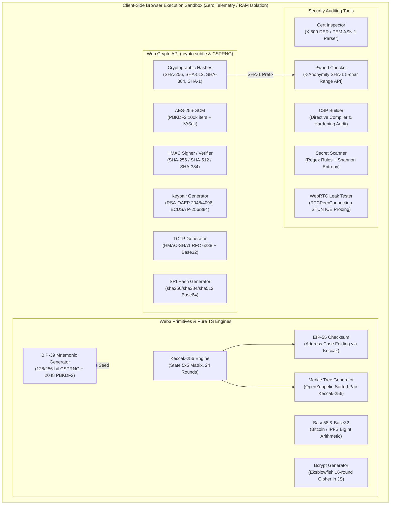
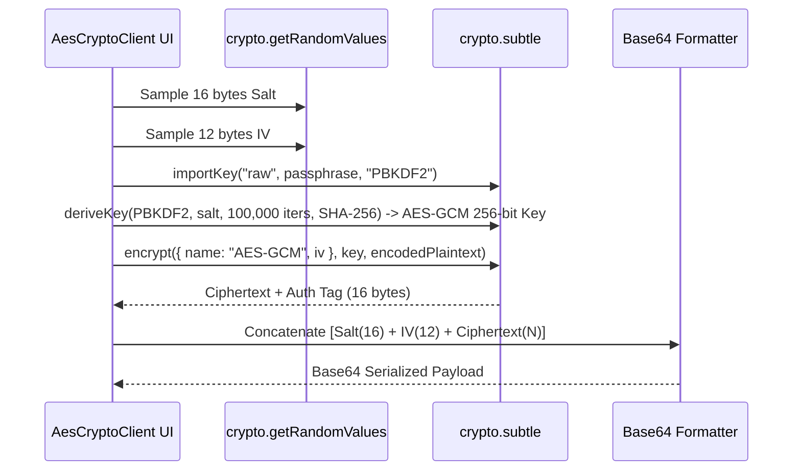
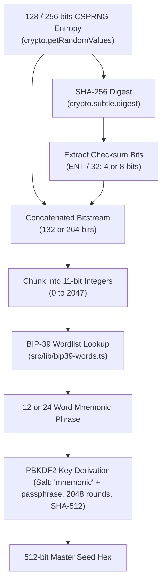

# Client-Side Cryptography & Security Suite

MegaTools hosts a comprehensive client-side cryptographic engine, Web3 primitives suite, and browser security auditing workbench. In accordance with the platform's zero-server-leakage architecture, all key derivations, symmetric ciphers, asymmetric keypair generations, mnemonic entropy sampling, Keccak/SHA hashing, and security scanning run strictly within client memory (V8/JavaScript engine) using standard Web APIs (`crypto.subtle`, `crypto.getRandomValues`, `RTCPeerConnection`). Sensitive cryptographic material—including plaintexts, passphrases, master seeds, and private keys—is never transmitted over the network or persisted to external storage.


*Architecture of client-side cryptographic engines, Web3 primitives, and security auditing tools.*

---

## 1. Client-Side Security Architecture

MegaTools enforces defense-in-depth guarantees ensuring high-assurance local computation:

### Web Crypto API (`crypto.subtle`) & Hardware Acceleration
The platform delegates symmetric and asymmetric operations to the browser's native `window.crypto.subtle` implementation. This leverages operating system cryptographic services (such as Windows CNG, macOS CommonCrypto, or Linux OpenSSL/NSS) with hardware-accelerated instructions (e.g., AES-NI, AVX-512, ARMv8 Cryptography Extensions) while guarding against JavaScript timing attacks:
- **AES-GCM Authenticated Encryption**: Hardware-accelerated Galois/Counter Mode cipher execution.
- **HMAC Signatures**: Constant-time message authentication code signing.
- **Key Derivation (PBKDF2)**: Standards-compliant key derivation with tunable round counts.
- **CSPRNG**: High-entropy pseudo-random number generation via `crypto.getRandomValues()`.

### Local Memory Key Isolation & Zero Telemetry
- **RAM-Only Scope**: Passphrases, salts, initialization vectors (IVs), unencrypted master seeds, and asymmetric private keys reside strictly in React component memory state and standard typed arrays (`Uint8Array`, `ArrayBuffer`).
- **Zero Local Persistence**: No secrets are cached in `localStorage`, `sessionStorage`, or `IndexedDB`. When a user closes or refreshes the tab, all key material is cleared by browser garbage collection.
- **Zero Telemetry & Egress Policy**: Cryptographic tools issue zero network requests. The only external network boundary crossings in the entire security suite are:
  1. `PwnedCheckerClient`: Transmits only a 5-character SHA-1 hash prefix to Have I Been Pwned via k-anonymity; the plaintext password and remaining 35 characters never leave local RAM.
  2. `WebRTCLeakClient`: Queries public STUN servers (`stun.l.google.com:19302`) via standard WebRTC browser APIs to discover reflective ICE candidates, and `api.ipify.org` via HTTPS GET to benchmark egress IP.

### Threading & UI Concurrency
High-iteration algorithms implemented in pure JavaScript—such as the pure Blowfish/Eksblowfish engine in `BcryptGeneratorClient`—wrap intensive computation in React concurrency transitions (`useTransition` / `startTransition`). This yields control back to the browser event loop between execution frames to prevent UI thread lockups during expensive round computations ($2^4$ through $2^{14}$ iterations).

---

## 2. Cryptographic & Hashing Utilities


*AES-256-GCM authenticated encryption and key derivation flow.*

### AES-256-GCM & PBKDF2 (`AesCryptoClient`)
- **Entrypoint**: `src/app/aes-crypto/AesCryptoClient.tsx`
- **Key Derivation**: Passphrases undergo key derivation using PBKDF2 with SHA-256 across 100,000 iterations:
  ```typescript
  const keyMaterial = await crypto.subtle.importKey(
    "raw",
    enc.encode(passphrase),
    "PBKDF2",
    false,
    ["deriveKey"]
  );
  const key = await crypto.subtle.deriveKey(
    {
      name: "PBKDF2",
      salt: salt.buffer as ArrayBuffer,
      iterations: 100_000,
      hash: "SHA-256",
    },
    keyMaterial,
    { name: "AES-GCM", length: 256 },
    false,
    ["encrypt", "decrypt"]
  );
  ```
- **Payload Framing**: Encryption generates a fresh 16-byte cryptographically secure random salt and a 12-byte initialization vector (IV) via `crypto.getRandomValues`. The resulting ciphertext (which includes the 128-bit GCM authentication tag appended by Web Crypto) is packed into a contiguous byte stream:
  $$\text{Payload} = \text{Salt (16 bytes)} \mathbin{\Vert} \text{IV (12 bytes)} \mathbin{\Vert} \text{Ciphertext + Tag ($N$ bytes)}$$
- **Decryption Verification**: In decrypt mode, payloads under 44 bytes ($16 + 12 + 16$) are immediately rejected. The salt and IV are sliced to re-derive the key, and `crypto.subtle.decrypt` verifies tag integrity; corrupted payloads or incorrect passphrases trigger an authentication failure error without exposing partial plaintext.

### Multi-Digest Hash Engine (`HashClient` & `FileChecksumClient`)
- **Entrypoints**: `src/app/hash-generator/HashClient.tsx`, `src/app/file-checksum/FileChecksumClient.tsx`
- **Supported Algorithms**: Parallel evaluation of `SHA-256` (256-bit), `SHA-512` (512-bit), `SHA-384` (384-bit), and `SHA-1` (160-bit) via `crypto.subtle.digest()`.
- **Streaming File Checksumming**: `FileChecksumClient` reads local `File` objects through `FileReader.readAsArrayBuffer()` directly into RAM. Hashes execute concurrently using `Promise.all()`, providing uppercase/lowercase hex rendering and instant hash match verification against user-provided release checksums.

### HMAC Generator & Verifier (`HmacGeneratorClient`)
- **Entrypoint**: `src/app/hmac-generator/HmacGeneratorClient.tsx`
- **Functionality**: Generates RFC 2104-compliant Hash-based Message Authentication Codes supporting `SHA-256`, `SHA-512`, `SHA-384`, and `SHA-1`.
- **Output Encodings**: Produces simultaneous hex representations, standard Base64, and URL-safe Base64 (`+` $\to$ `-`, `/` $\to$ `_`, trailing `=` stripped). Includes signature comparison logic for verifying incoming webhooks (e.g., GitHub, Stripe, Shopify).

### Asymmetric Keypair Generator (`KeypairGeneratorClient`)
- **Entrypoint**: `src/app/keypair-generator/KeypairGeneratorClient.tsx`
- **Supported Key Types**:
  - `RSA-2048` & `RSA-4096`: Generates RSA-OAEP keypairs using public exponent $e = 65537$ (`new Uint8Array([1, 0, 1])`) and SHA-256 hashing.
  - `ECDSA-P256` & `ECDSA-P384`: Generates elliptic curve keypairs over NIST curves P-256 or P-384 for signing and verification.
- **Export & Serialization**: Keys are exported via `crypto.subtle.exportKey("spki", keyPair.publicKey)` and `crypto.subtle.exportKey("pkcs8", keyPair.privateKey)`. Exported binary buffers are Base64 encoded and framed in 64-column PEM wrappers (`BEGIN PUBLIC KEY` / `BEGIN PRIVATE KEY`).
- **Fingerprinting**: Computes a SHA-256 fingerprint over the exported SPKI public key buffer, rendered as colon-separated hex bytes.

### Subresource Integrity Generator (`SriHashGeneratorClient`)
- **Entrypoint**: `src/app/sri-hash-generator/SriHashGeneratorClient.tsx`
- **Specification**: Computes W3C Subresource Integrity (SRI) hashes (`sha256-...`, `sha384-...`, `sha512-...`) over pasted script/style source code or uploaded assets, formatting ready-to-use `<script src="..." integrity="..." crossorigin="anonymous">` and `<link rel="stylesheet">` tags.

### Time-Based One-Time Password Engine (`TotpGeneratorClient`)
- **Entrypoint**: `src/app/totp-generator/TotpGeneratorClient.tsx`
- **RFC 6238 Implementation**: Derives 6-digit or 8-digit OTP tokens from RFC 4648 Base32 secret keys.
- **Mechanism**:
  1. Base32 secret decoded into raw binary key bytes.
  2. Unix epoch divided by time step (default 30 seconds) into an 8-byte big-endian counter buffer (`DataView.setUint32(4, counter, false)`).
  3. Key imported as `HMAC` with `SHA-1` (or `SHA-256` / `SHA-512`).
  4. Truncation calculates dynamic offset from the final byte's lower 4 bits (`offset = hash[19] & 0xf`) and extracts a 31-bit big-endian integer modulo $10^{\text{digits}}$.

### Bcrypt Generator & Verifier (`BcryptGeneratorClient`)
- **Entrypoint**: `src/app/bcrypt-generator/BcryptGeneratorClient.tsx`
- **Pure JavaScript Eksblowfish**: Zero-dependency implementation of the standard OpenBSD Eksblowfish cipher:
  - Custom Base64 alphabet: `./ABCDEFGHIJKLMNOPQRSTUVWXYZabcdefghijklmnopqrstuvwxyz0123456789`
  - Initializes P-array (18 subkeys) and S-boxes (four 256-word tables) derived from digits of $\pi$.
  - Executes expensive key setup across $2^{\text{cost}}$ iterations (configurable log2 cost from 4 to 14 rounds).
  - Enciphers standard 24-byte string `"OrpheanBeholderScryDoubt"` 64 times to produce the 192-bit hash.
- **Hash Framing**: Formats standard modular crypt format: `$2b$<cost>$<22-char-salt><31-char-hash>`. Verifies existing hashes by extracting cost and salt, re-executing key expansion, and performing string equivalence checks.

---

## 3. Web3 & Cryptographic Primitives


*BIP-39 mnemonic generation, checksum calculation, and seed derivation pipeline.*

### BIP-39 Mnemonic Generator & Validator (`Bip39GeneratorClient`)
- **Entrypoints**: `src/app/bip39-generator/Bip39GeneratorClient.tsx`, `src/lib/bip39-words.ts`
- **Entropy & Word Count**: Supports 12-word (128 bits entropy, 4 bits checksum $\to$ 132 bits total) and 24-word (256 bits entropy, 8 bits checksum $\to$ 264 bits total) configurations.
- **Algorithm**:
  1. Cryptographically secure entropy generated via `crypto.getRandomValues(new Uint8Array(len))`.
  2. Entropy hashed with SHA-256; leading $\text{entropyBits} / 32$ bits appended to entropy as checksum.
  3. Combined bitstream sliced into 11-bit chunks ($2^{11} = 2048$).
  4. Each integer indexes into the official 2048-word English dictionary (`BIP39_WORDLIST`).
- **Seed Derivation**: Derives the 512-bit binary seed via PBKDF2 (`crypto.subtle.deriveBits`):
  - Password: NFKD-normalized mnemonic string.
  - Salt: NFKD-normalized string `"mnemonic" + passphrase`.
  - Iterations: 2,048 rounds of HMAC-SHA-512.
- **Validation**: `BIP39_WORD_MAP` (`Map<string, number>`) validates user-pasted phrases in $O(1)$ time, verifying word count (12 or 24) and dictionary presence.

### Pure TypeScript Keccak-256 Engine (`keccak.ts` & `KeccakCalculatorClient`)
- **Entrypoints**: `src/lib/keccak.ts`, `src/app/keccak-calculator/KeccakCalculatorClient.tsx`
- **Algorithm Architecture**: Zero-dependency pure TypeScript implementation of Ethereum-standard Keccak-256 (differing from NIST SHA3-256 in padding):
  - State: $5 \times 5$ matrix of 64-bit unsigned words represented as JavaScript `bigint`.
  - Rate: 1088 bits (136 bytes); Capacity: 512 bits.
  - Ethereum padding: `0x01` pad byte and `0x80` terminator byte (`0x81` if single byte padding).
  - Permutation: 24 rounds of Keccak-$f[1600]$ executing $\theta$ (Theta), $\rho$ (Rho), $\pi$ (Pi), $\chi$ (Chi), and $\iota$ (Iota) bitwise transformations using 64-bit circular left shifts (`rotl64`).
- **Function Selector Generation**: Calculates 4-byte EVM function selectors (e.g. `keccak256("transfer(address,uint256)").slice(0, 8)` $\to$ `0xa9059cbb`).

### EIP-55 Address Checksumming (`Eip55ChecksumClient`)
- **Entrypoints**: `src/app/eip55-checksum/Eip55ChecksumClient.tsx`, `src/lib/keccak.ts`
- **Specification**: Validates and formats mixed-case Ethereum addresses to prevent transfer typos:
  ```typescript
  export function toChecksumAddress(address: string): string {
    const addr = address.toLowerCase().replace(/^0x/, "");
    const hash = keccak256Hex(addr);
    let checksum = "0x";
    for (let i = 0; i < addr.length; i++) {
      if (parseInt(hash[i], 16) >= 8) {
        checksum += addr[i].toUpperCase();
      } else {
        checksum += addr[i].toLowerCase();
      }
    }
    return checksum;
  }
  ```
- **Analysis States**: Classifies inputs into `CHECKSUMMED_VALID`, `ALL_LOWERCASE`, `ALL_UPPERCASE`, or `CHECKSUM_CORRUPTED` (highlighting potential address alteration).

### Merkle Tree Generator (`MerkleTreeGeneratorClient`)
- **Entrypoint**: `src/app/merkle-tree-generator/MerkleTreeGeneratorClient.tsx`
- **Standard**: Implements OpenZeppelin MerkleProof-compatible binary trees.
- **Leaf Computation**: Keccak-256 hash of canonical lowercase EVM address bytes (or text inputs).
- **Pair Hashing with Lexicographical Sorting**: To prevent second preimage vulnerabilities and ensure deterministic trees independent of leaf ordering:
  ```typescript
  function hashPair(aHex: string, bHex: string): string {
    const a = aHex.replace(/^0x/, "").toLowerCase();
    const b = bHex.replace(/^0x/, "").toLowerCase();
    const combined = a < b ? a + b : b + a;
    return keccak256Hex(hexToBytes(combined));
  }
  ```
- **Layer Construction & Odd Promotion**: Progressively hashes adjacent pairs. If a layer contains an odd number of nodes, the trailing element is promoted to the next level without pairing.
- **Proof Generation**: Extracts sibling hashes along the path from any selected leaf index up to the root, formatting proofs as `bytes32[]` arrays ready for Solidity smart contract verification.

### Base58 & Base32 Encoding (`Base58ConverterClient` & `SolanaConverterClient`)
- **Entrypoints**: `src/app/base58-converter/Base58ConverterClient.tsx`, `src/app/solana-converter/SolanaConverterClient.tsx`
- **Bitcoin Base58 Alphabet**: `123456789ABCDEFGHJKLMNPQRSTUVWXYZabcdefghijkmnopqrstuvwxyz` (omits `0`, `O`, `I`, `l` to prevent visual ambiguity).
- **Arithmetic Engine**: Arbitrary-precision integer division and modulo arithmetic using numeric arrays, preserving leading zero bytes as `'1'` prefixes.
- **Solana Account Validation**: `SolanaConverterClient` decodes 32-byte public keys and maps known program IDs (System Program, SPL Token, Associated Token Account, Metaplex).

---

## 4. Security Auditing Tools

```mermaid
flowchart LR
    subgraph BrowserClient["Browser Memory"]
        Input["Plaintext Password"]
        SHA1["crypto.subtle.digest('SHA-1')"]
        Split["Prefix: First 5 chars\nSuffix: Remaining 35 chars"]
    end

    subgraph HIBP["Have I Been Pwned API"]
        RangeEndpoint["GET /range/{prefix}"]
        Response["List of ~500 hashes:\n{suffix_hash}:{count}"]
    end

    Input --> SHA1 --> Split
    Split -->|Only 5-char prefix| RangeEndpoint
    RangeEndpoint --> Response
    Response -->|Local RAM Search| MatchCheck{"Suffix in response?"}
    Split -.->|35-char suffix (never sent)| MatchCheck
    MatchCheck -->|Yes| Breached["Status: Breached (Count: N)"]
    MatchCheck -->|No| Safe["Status: Safe (0 Breaches)"]
```
*k-Anonymity breach detection workflow in PwnedCheckerClient.*

### Pwned Password Checker (`PwnedCheckerClient`)
- **Entrypoint**: `src/app/pwned-checker/PwnedCheckerClient.tsx`
- **Privacy Model (k-Anonymity)**:
  1. Computes full SHA-1 hash of the password locally via `crypto.subtle.digest("SHA-1", ...)`.
  2. Splits 40-character hex string into a 5-character prefix and 35-character suffix.
  3. Sends only the 5-character prefix to `https://api.pwnedpasswords.com/range/{prefix}` with header `Add-Padding: true` (which adds dummy records to prevent response size side-channel leakage).
  4. Parses returned list of suffix hashes (~500 entries) and checks for matching suffix locally in RAM.
  5. Aborts inflight requests using `AbortController` when the user edits input.

### WebRTC Leak Tester (`WebRTCLeakClient`)
- **Entrypoint**: `src/app/webrtc-leak/WebRTCLeakClient.tsx`
- **Vulnerability Model**: Tests whether browser WebRTC peer-to-peer implementations bypass VPN tunnels or local proxies to expose local LAN IP addresses or public ISP gateways.
- **Probe Flow**:
  1. Instantiates `RTCPeerConnection` configured with public Google STUN servers (`stun:stun.l.google.com:19302`).
  2. Creates a mock data channel (`megatools-leak-probe`) and generates a local SDP offer (`createOffer()`).
  3. Listens to `onicecandidate` events, parsing ICE candidate SDP lines:
     - `typ host`: Local machine IP address (or mDNS randomized `.local` token).
     - `typ srflx`: Server Reflexive public IP address gathered from STUN reflector.
  4. Concurrently fetches public HTTP egress IP from `https://api.ipify.org?format=json`.
  5. **Leak Classification**:
     - `shielded`: Only mDNS anonymized candidates found; no public STUN leaks.
     - `secure_tunnel`: Public WebRTC candidate matches HTTP egress IP (VPN properly routes STUN traffic).
     - `leaked`: Public WebRTC candidate differs from HTTP egress IP (VPN bypass detected).
     - `blocked`: WebRTC API disabled or blocked by browser extensions.

### X.509 Certificate Inspector (`CertInspectorClient`)
- **Entrypoint**: `src/app/cert-inspector/CertInspectorClient.tsx`
- **Parser Implementation**: Zero-dependency client-side ASN.1/DER scanner.
- **Extraction Capabilities**:
  - Strips PEM framing (`-----BEGIN CERTIFICATE-----`) and decodes Base64 to binary DER byte array.
  - Regex-based ASN.1 tag scanner identifies UTCTime (`YYMMDDHHMMSSZ`) and GeneralizedTime (`YYYYMMDDHHMMSSZ`) to extract `notBefore`, `notAfter`, days remaining, and expiry status.
  - Scans Subject Alternative Names (SANs) and common domain patterns.
  - Extracts serial number hex strings and estimates signature algorithms (`sha256WithRSAEncryption`, `ecdsa-with-SHA384`, etc.).

### Content Security Policy Builder (`CspBuilderClient`)
- **Entrypoint**: `src/app/csp-builder/CspBuilderClient.tsx`
- **Directive Management**: Interactive matrix configuring modern W3C CSP Level 3 directives: `default-src`, `script-src`, `style-src`, `img-src`, `font-src`, `connect-src`, `object-src`, `frame-ancestors`, `base-uri`, `form-action`, and `upgrade-insecure-requests`.
- **Cryptographic Nonce Generator**: Samples 16 random bytes via `crypto.getRandomValues` and formats `'nonce-<base64>'` tokens for script hardening.
- **Real-Time Security Auditor**: Warns against critical misconfigurations:
  - Presence of `'unsafe-inline'` in `script-src` (XSS vulnerability).
  - Presence of `'unsafe-eval'` in `script-src`.
  - Missing `object-src 'none'` (Flash/plugin execution risk).
  - Missing `base-uri` (relative path hijacking risk).
  - Missing `frame-ancestors` (clickjacking vulnerability).
- **Multi-Platform Exporter**: Formats policy as raw HTTP header, HTML `<meta>` tag, Nginx configuration, Apache `.htaccess`, Vercel `vercel.json`, and Next.js `next.config.mjs` headers.

### Static Secret Scanner (`SecretScannerClient`)
- **Entrypoint**: `src/app/secret-scanner/SecretScannerClient.tsx`
- **Dual-Engine Detection**: Combines deterministic regex pattern matching with Shannon entropy analysis:
  - **Shannon Entropy Calculation**:
    $$H(X) = -\sum_{i=1}^{n} P(x_i) \log_2 P(x_i)$$
    Computes per-token entropy to differentiate high-randomness cryptographic secrets from ordinary code identifiers.
  - **Pattern Matching**: Scans 15+ credential formats including AWS Access Keys (`AKIA...`), AWS Secret Keys, GitHub PATs (`ghp_...`, `github_pat_...`), OpenAI API keys (`sk-...`, `sk-proj-...`), Anthropic API keys (`sk-ant-...`), Google API keys (`AIza...`), Stripe API keys (`sk_live_...`), Slack tokens/webhooks, and PEM private key headers.
- **Redaction Utility**: Generates sanitized versions of scanned text replacing matched secrets with context-aware redaction masks (`[REDACTED_AWS_ACCESS_KEY]`, etc.).

---

## 5. Tool Matrix & Component Contracts

| Tool Identifier | Route Slug | Primary Technology | Core Function / Standard | Zero-Leakage Guarantee |
| :--- | :--- | :--- | :--- | :--- |
| `aes-crypto` | `/aes-crypto` | Web Crypto API | AES-256-GCM + PBKDF2 (100k iters) | 100% In-Browser RAM |
| `hash-generator` | `/hash-generator` | Web Crypto API | SHA-256, SHA-512, SHA-384, SHA-1 | 100% In-Browser RAM |
| `file-checksum` | `/file-checksum` | Web Crypto + FileReader | Local file buffer digest calculation | 100% In-Browser RAM |
| `hmac-generator` | `/hmac-generator` | Web Crypto API | HMAC-SHA256/512/384 signing & verify | 100% In-Browser RAM |
| `keypair-generator`| `/keypair-generator` | Web Crypto API | RSA-OAEP 2048/4096, ECDSA P-256/384 | 100% In-Browser RAM |
| `totp-generator` | `/totp-generator` | Web Crypto API | RFC 6238 TOTP HMAC-SHA1 + Base32 | 100% In-Browser RAM |
| `sri-hash-generator`| `/sri-hash-generator`| Web Crypto API | W3C Subresource Integrity (SHA-384/256) | 100% In-Browser RAM |
| `bcrypt-generator` | `/bcrypt-generator` | Pure JavaScript | OpenBSD Eksblowfish cipher ($2^4 - 2^{14}$) | 100% In-Browser RAM |
| `bip39-generator` | `/bip39-generator` | Web Crypto CSPRNG | BIP-39 12/24 words, 2048 PBKDF2 seed | 100% In-Browser RAM |
| `keccak-calculator`| `/keccak-calculator`| Pure TypeScript | Keccak-256 (BigInt 5x5 state, 24 rounds)| 100% In-Browser RAM |
| `eip55-checksum` | `/eip55-checksum` | Pure TypeScript | EIP-55 Ethereum address case folding | 100% In-Browser RAM |
| `merkle-tree-generator`| `/merkle-tree-generator`| Pure TypeScript | OpenZeppelin sorted-pair Keccak tree | 100% In-Browser RAM |
| `base58-converter`| `/base58-converter` | Pure TypeScript | Bitcoin Base58 & RFC 4648 Base32 | 100% In-Browser RAM |
| `solana-converter`| `/solana-converter` | Pure TypeScript | SOL/Lamport math & Base58 public keys | 100% In-Browser RAM |
| `cert-inspector` | `/cert-inspector` | Pure TypeScript | X.509 DER ASN.1 scanner & SAN extractor | 100% In-Browser RAM |
| `csp-builder` | `/csp-builder` | Pure TypeScript | W3C CSP Level 3 builder & audit rules | 100% In-Browser RAM |
| `secret-scanner` | `/secret-scanner` | Pure TypeScript | Regex catalog + Shannon entropy audit | 100% In-Browser RAM |
| `pwned-checker` | `/pwned-checker` | Web Crypto + Range API| k-Anonymity 5-char SHA-1 prefix query | 5-char prefix only |
| `webrtc-leak` | `/webrtc-leak` | WebRTC RTCPeerConnection| STUN reflective ICE gathering probe | STUN probe only |

---

## 6. Verification & Test Vectors

Key cryptographic and Web3 algorithms can be verified against canonical test vectors:

- **Keccak-256 Empty String**:
  $$\text{keccak256}("") = \text{c5d2460186f7233c927e7db2dcc703c0e500b653ca82273b7bfad8045d85a470}$$
  Evaluated in `src/lib/keccak.ts#keccak256Hex`.
- **EVM Function Selector**:
  $$\text{keccak256}("transfer(address,uint256)").slice(0, 8) = \text{a9059cbb}$$
  Tested in `src/app/keccak-calculator/KeccakCalculatorClient.tsx`.
- **EIP-55 Address Checksum**:
  - Raw lowercase: `0x5aaeb6053f3e94c9b9a09f33669435e7ef1beaed`
  - Valid checksum: `0x5aAeb6053F3E94C9b9A09f33669435E7Ef1BeAed`
  - Computed via `src/lib/keccak.ts#toChecksumAddress`.
- **BIP-39 Test Vector (128-bit Zero Entropy)**:
  - 16 zero bytes `0x00...00` yields checksum `0x3` $\to$ First word index `00000000000` (`abandon`).
  - Standard dictionary validation supported in `src/lib/bip39-words.ts`.
- **OpenZeppelin Sorted Merkle Pair**:
  Given leaf hashes $A$ and $B$, parent node is always $\text{keccak256}(\min(A, B) \mathbin{\Vert} \max(A, B))$, preventing duplicate node proof vulnerabilities.
