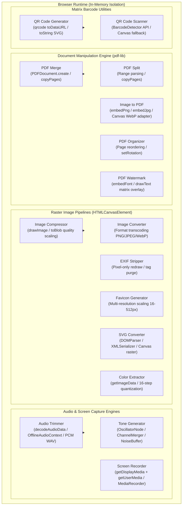
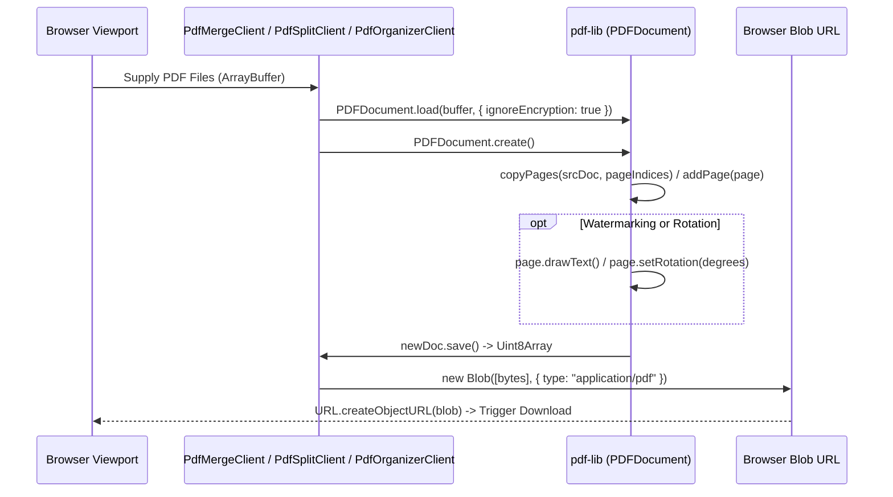
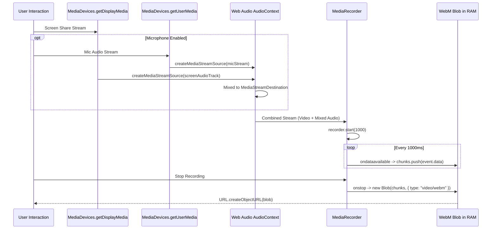

# Media Processing & Document Engines

MegaTools executes all document assembly, raster image manipulation, audio processing, screen recording, and matrix barcode workflows entirely within client-side browser runtime memory. The platform relies on modern browser APIs (`HTMLCanvasElement`, Web Audio API, MediaStreams, `MediaRecorder`, `BarcodeDetector`) and dedicated client-side packages (`pdf-lib`, `qrcode`) to process high-volume binary payloads without remote server transfers or data leakage.


*Architecture and taxonomy of client-side media and document processing engines.*

---

## 1. Document Manipulation Engine (`pdf-lib`)

Document manipulation tools operate over raw `ArrayBuffer` and `Uint8Array` buffers using `pdf-lib`. All PDF reading, layout generation, page extraction, page reordering, coordinate math, and serialization execute without native binary plugins or backend microservices.


*Lifecycle of document parsing, transformation, and serialization in browser memory.*

### PDF Merge (`src/app/pdf-merge/PdfMergeClient.tsx`)
- **Document Loading**: Reads uploaded files as `ArrayBuffer` instances and initializes source documents via `PDFDocument.load(buffer, { ignoreEncryption: true })`.
- **Page Accumulation**: Instantiates a blank destination document with `PDFDocument.create()`. Iterates across each loaded document in user-selected sequence, extracts page indices with `srcDoc.getPageIndices()`, copies page references via `mergedDoc.copyPages(srcDoc, indices)`, and appends them with `mergedDoc.addPage(page)`.
- **Output Compilation**: Invokes `mergedDoc.save()`, producing a `Uint8Array` that wraps into a client `Blob` with MIME type `application/pdf` and releases previous Object URLs.

### PDF Split & Page Extractor (`src/app/pdf-split/PdfSplitClient.tsx`)
- **Range Tokenizer**: Parses numeric expressions and ranges (e.g., `1-3, 5, 8-10`) via `parsePageRanges(input, totalPages)`. Filters out of bound values and deduplicates indices using a sorted `Set<number>`.
- **Targeted Page Extraction**: Maps user-facing 1-based page numbers to 0-based indices (`selectedPages.map(p => p - 1)`). Invokes `newDoc.copyPages(srcDoc, pageIndices)` and appends only selected pages before binary compilation.

### Image to PDF (`src/app/image-to-pdf/ImageToPdfClient.tsx`)
- **Direct & Transcoded Embedding**: Embeds PNG and JPEG image buffers directly using `pdfDoc.embedPng(imageBytes)` and `pdfDoc.embedJpg(imageBytes)`.
- **WebP Adapter**: Because `pdf-lib` does not provide native WebP parser decoding, WebP images are piped through an offscreen `HTMLCanvasElement`, rasterized with `ctx.drawImage()`, and converted via `canvas.toBlob(resolve, "image/png")` to PNG byte buffers before embedding.
- **Page Sizing & Aspect Calculation**: Supports standard page sizing presets:
  - `fit`: Page dimensions match original image dimensions plus configured padding margins (`pWidth = img.width + margin * 2`, `pHeight = img.height + margin * 2`).
  - `a4` (595.28 × 841.89 pt) and `letter` (612 × 792 pt): Dynamically calculates portrait/landscape orientation based on aspect ratio or user override, computing letterboxed draw coordinates `(drawX, drawY)` to maintain uniform scale (`scale = Math.min(availW / drawW, availH / drawH, 1)`).

### PDF Page Organizer (`src/app/pdf-organizer/PdfOrganizerClient.tsx`)
- **Metadata Extraction**: Loads `PDFDocument` and extracts per-page dimensions (`page.getSize()`) and initial rotation angles (`page.getRotation().angle`).
- **Non-Destructive Reordering**: Manipulates an array of page descriptor objects (`PageMeta { originalIndex, currentRotation, width, height }`). Supports interactive index splicing, whole-document reversal (`reverseOrder()`), individual page deletion, and 90-degree rotational incrementing.
- **Assembly Serialization**: Reconstructs the document by copying each page by its `originalIndex` from the cached source document, applying `copiedPage.setRotation(degrees(p.currentRotation))`, and adding pages in reorganized order.

### PDF Watermark Engine (`src/app/pdf-watermark/PdfWatermarkClient.tsx`)
- **Font & Dimension Calculations**: Embeds standard PDF typography using `doc.embedFont(StandardFonts.HelveticaBold)`. Measures watermark text bounds at specified font size using `font.widthOfTextAtSize(text, fontSize)` and `font.heightAtSize(fontSize)`.
- **Trigonometric Rotation Offsetting**: Compensates for center-point rotation when positioning text across pages:
  $$\text{rad} = \frac{\theta \cdot \pi}{180}$$
  $$X = \frac{W}{2} - \left(\cos(\text{rad}) \cdot \frac{\text{textWidth}}{2} - \sin(\text{rad}) \cdot \frac{\text{textHeight}}{2}\right)$$
  $$Y = \frac{H}{2} - \left(\sin(\text{rad}) \cdot \frac{\text{textWidth}}{2} + \cos(\text{rad}) \cdot \frac{\text{textHeight}}{2}\right)$$
- **Page Stamping**: Iterates across every page in `doc.getPages()`, stamping rotated vector text with configurable `rgb` color values and fractional opacity.
- **Real-Time Canvas Simulation**: Uses a synchronized 2D canvas preview with simulated document lines and affine transform matrix rotation (`ctx.translate`, `ctx.rotate`) to preview watermark placement before compiling.

---

## 2. Client-Side Raster Image Pipelines

Raster image manipulation tools utilize the browser's 2D rendering context (`CanvasRenderingContext2D`) backed by hardware-accelerated GPU rasters.

<!-- openwiki: mermaid parse failed and this diagram was converted to a text fence so it does not break rendering. Fix the diagram source and restore the mermaid fence. Parser error: Heuristic: an unescaped angle bracket inside a label breaks rendering; rephrase the label. -->
```text
flowchart LR
    File[Input File / Blob] --> ObjectURL[URL.createObjectURL]
    ObjectURL --> ImageElement[HTMLImageElement]
    ImageElement --> Canvas[HTMLCanvasElement (2D Context)]
    Canvas -->|ctx.drawImage| Pixels[Pixel Buffer (RGB/RGBA)]
    Pixels -->|canvas.toBlob(type, quality)| OutputBlob[Clean Sanitized / Transcoded Blob]
    OutputBlob --> Download[URL.createObjectURL -> Download]
    Canvas -->|ctx.getImageData| Analysis[Palette Quantization / Metadata Analysis]
```
*Pipeline flow for canvas-driven image compression, conversion, EXIF purging, and palette sampling.*

### Image Compression & Scaling (`src/app/image-compressor/ImageClient.tsx`)
- **Aspect-Ratio Downsampling**: Inspects source dimensions against a configurable `maxWidth` threshold. If the original width exceeds `maxWidth`, height is proportionally downsampled: `height = Math.round((height * maxW) / width)`.
- **Alpha Channel Solidification**: When encoding to JPEG (`image/jpeg`), which lacks an alpha channel, the context paints a solid white background (`#ffffff`) across the entire canvas rectangle prior to drawing the source image, preventing dark artifacting on transparent pixels.
- **Lossy Quantization**: Calls `canvas.toBlob(callback, format, quality / 100)` to trigger native browser lossy compression algorithms (libjpeg-turbo or libwebp inside the browser engine).

### Image Format Converter (`src/app/image-converter/ImageConverterClient.tsx`)
- **Format Transcoding**: Provides client-side format conversion between `image/png`, `image/jpeg`, and `image/webp`.
- **Parameter Switching**: Selectively supplies a normalized floating-point quality argument `[0.0, 1.0]` when exporting to lossy targets (`image/jpeg`, `image/webp`), omitting quality controls for lossless PNG.

### EXIF & Metadata Stripping (`src/app/exif-stripper/ExifStripperClient.tsx`)
- **Privacy Preservation through Pixel Redrawing**: Rather than parsing and unlinking EXIF binary segments (APP1 markers, TIFF header tags, GPS IFD), the tool draws image pixels onto an offscreen canvas with `ctx.drawImage(img, 0, 0)`.
- **Header Re-encoding**: Generates a completely new JPEG or PNG binary container via `canvas.toBlob()`. Because the canvas serializes raw pixel bitmap data directly from browser graphics memory, all exchangeable image file format (EXIF), IPTC, XMP, camera serial numbers, and GPS geotags are entirely purged.

### Favicon Generator (`src/app/favicon-generator/FaviconGeneratorClient.tsx`)
- **Multi-Resolution Resampling**: Scales source icons across 5 standard favicon resolutions (16×16, 32×32, 48×48, 180×180 for Apple Touch, 512×512 for Android/PWA).
- **Format Delivery**: Exports individual resized PNG data URLs and compiles standard HTML `<link rel="icon">` header snippets.

### Vector-to-Raster SVG Converter (`src/app/svg-converter/SvgConverterClient.tsx`)
- **XML Parsing & Validation**: Uses `DOMParser` to parse SVG text into an XML DOM document (`image/svg+xml`), checking for syntax errors in `<parsererror>` tags.
- **Scale Factor Rasterization**: Extracts dimensions from SVG root attributes or `viewBox` coordinates, multiplies by a user-selected scale multiplier (1x, 2x, 4x, 8x for high-DPI rendering), renders the vector markup into an `Image` element via a data URL or Blob URL, and exports rasterized PNG, JPEG, or WebP blobs.

### Color Palette Extractor (`src/app/color-extractor/ColorExtractorClient.tsx`)
- **Pixel Sampling**: Obtains raw RGBA pixel arrays from an offscreen canvas via `ctx.getImageData(0, 0, width, height).data`.
- **Fast 16-Step Color Quantization**: Iterates through the pixel array stepping every 16 bytes (subsampling every 4th pixel for UI performance), quantizing RGB values into 16-unit buckets (`r - (r % 16)`). Finds dominant frequency clusters and converts them to Hex, RGB, and HSL notation.

---

## 3. Audio & Video Processing Pipelines

Media tools use the Web Audio API (`AudioContext`, `OfflineAudioContext`) and screen capture streaming APIs (`MediaDevices.getDisplayMedia`, `MediaRecorder`) without server media engines (e.g. FFmpeg server workers).


*Audio/video stream acquisition, Web Audio channel mixing, and chunked recording pipeline.*

### Audio Trimmer & PCM WAV Encoder (`src/app/audio-trimmer/AudioTrimmerClient.tsx`)
- **In-Memory Decoding**: Ingests raw audio files (`ArrayBuffer`) and decodes compressed formats (MP3, AAC, OGG, FLAC) into uncompressed 32-bit floating-point audio data via `audioCtx.decodeAudioData(arrayBuf)`.
- **Interactive Waveform Rendering**: Samples channel audio buffer arrays (`buffer.getChannelData(0)`), computes peak minimum and maximum amplitude thresholds per horizontal display bucket (`step = Math.ceil(rawData.length / width)`), and draws an interactive waveform graph highlighting active trim bounds.
- **Offline Sub-buffer Extraction**: Creates an `OfflineAudioContext(numChannels, length, sampleRate)` matching slice bounds (`startSample = Math.floor(startTime * sampleRate)`). Copies channel subarrays directly from the source buffer.
- **Custom PCM WAV Serializer (`audioBufferToWav`)**: Encodes uncompressed 16-bit linear PCM audio into a standard RIFF/WAVE container entirely in JavaScript:
  - Writes standard 44-byte RIFF headers (`RIFF`, total byte count, `WAVE`, `fmt ` chunk, PCM format tag `1`, channel count, sample rate, byte rate, block alignment, 16-bit depth, and `data` chunk header).
  - Interleaves multi-channel audio data and clamps 32-bit float samples `[-1.0, 1.0]` into signed 16-bit integers (`sample < 0 ? sample * 0x8000 : sample * 0x7fff`).
  - Serializes via `DataView` into an `ArrayBuffer` wrapped in a `Blob({ type: "audio/wav" })`.

### Tone, Noise & Binaural Synthesizer (`src/app/tone-generator/ToneGeneratorClient.tsx`)
- **Audio Routing Graph**: Connects sound generators through a dynamic gain stage (`GainNode`) to an oscilloscope analyser (`AnalyserNode`) and output `audioCtx.destination`.
- **Operating Modes**:
  1. **Monophonic Tone**: Uses `OscillatorNode` with configurable waveforms (`sine`, `square`, `sawtooth`, `triangle`) and continuous frequency adjustments (`osc.frequency.setTargetAtTime()`).
  2. **Binaural Beats**: Utilizes a `ChannelMergerNode(2)` to construct true stereo phase divergence. Routes a base carrier frequency oscillator to the left channel (`merger.connect(gainNode, 0, 0)`) and an offset oscillator (`base + beatFrequency`) to the right channel (`merger.connect(gainNode, 0, 1)`).
  3. **Algorithmic Noise Synthesis**: Generates procedural white, pink, or brown noise loops in an uncompressed 2-second `AudioBuffer`:
     - *White Noise*: Uniform pseudo-random distribution (`Math.random() * 2 - 1`).
     - *Pink Noise*: Implements Paul Kellet’s 6-pole IIR filter algorithm to produce a 3 dB/octave spectral rolloff:
       $$b_0 = 0.99886 \cdot b_0 + \text{white} \cdot 0.0555179$$
       $$b_1 = 0.99332 \cdot b_1 + \text{white} \cdot 0.0750759$$
       $$\text{output} = (b_0 + b_1 + b_2 + b_3 + b_4 + b_5 + b_6 + \text{white} \cdot 0.5362) \cdot 0.11$$
     - *Brown Noise*: First-order integrated random walk with gain compensation:
       $$\text{data}_i = \frac{\text{lastOut} + 0.02 \cdot \text{white}}{1.02}$$
- **Real-Time Oscilloscope**: Animates an oscilloscope wave visualization using `analyser.getByteTimeDomainData()` synchronized with `requestAnimationFrame`.

### Screen Recorder (`src/app/screen-recorder/ScreenRecorderClient.tsx`)
- **Display & Audio Capture**: Obtains video display streams via `navigator.mediaDevices.getDisplayMedia({ video: { frameRate: { ideal: 30 } }, audio: true })`.
- **Web Audio Stream Multiplexing**: When microphone audio is toggled, capture requests microphone inputs with `navigator.mediaDevices.getUserMedia({ audio: true })`. Initializes an `AudioContext`, pipes both screen audio and microphone audio through `createMediaStreamSource()` into a shared `MediaStreamAudioDestinationNode`, and synthesizes a combined `MediaStream` containing screen video and mixed audio tracks.
- **Chunked Media Recording**: Initializes `MediaRecorder` targeting supported MIME containers in order of browser preference (`video/webm;codecs=vp9,opus`, `video/webm`, or `video/mp4`). Slices output chunks every 1000ms (`recorder.start(1000)`), accumulating data buffers in memory until completion.

---

## 4. QR Code & Matrix Barcode Engines

QR processing covers client-side matrix barcode generation and barcode decoding.

```mermaid
flowchart TD
    subgraph QR_Generation["QR Code Generation"]
        Text[String Input] --> QR_Lib["qrcode (Node/Browser JS Library)"]
        QR_Lib -->|toDataURL| PNG_URL[PNG Data URL]
        QR_Lib -->|toString(type: 'svg')| SVG_Blob[Scalable Vector Graphics Blob]
    end

    subgraph QR_Scanning["QR Code Detection"]
        Capture[File Drop / Paste Image] --> Img[Image Element]
        Img --> DetectSupported{BarcodeDetector Supported?}
        DetectSupported -->|Yes| HardwareDetector["new BarcodeDetector({ formats: ['qr_code'] })"]
        HardwareDetector --> BarcodeValue[Decoded Raw Value String]
        DetectSupported -->|No| CanvasFallback[Offscreen Canvas Grayscale Fallback]
    end
```
*QR generation and hardware-accelerated detection pipelines.*

### QR Code Generator (`src/app/qrcode/QRClient.tsx`)
- **Dual Format Matrix Engine**: Relies on the `qrcode` library to generate 2D Quick Response matrices.
- **Configurable Fault Tolerance**: Exposes 4 ISO/IEC 18004 Reed-Solomon Error Correction levels: `L` (~7%), `M` (~15%), `Q` (~25%), and `H` (~30%).
- **Multi-Vector Export**:
  - **PNG Raster**: Computes pixel matrices directly to data URLs via `QRCode.toDataURL(text, { width, margin, errorCorrectionLevel })`.
  - **SVG Vector**: Renders vector paths with `QRCode.toString(text, { type: "svg", ... })`, packaging the SVG markup string into a clean XML blob for infinite-resolution scaling.

### QR Code Scanner (`src/app/qr-scanner/QrScannerClient.tsx`)
- **Hardware-Accelerated Detection**: Checks for the native browser `BarcodeDetector` API (`"BarcodeDetector" in window`). When supported, it passes the loaded image directly to the underlying platform engine (`new BarcodeDetector({ formats: ["qr_code"] }).detect(img)`), offloading matrix recognition to OS/hardware decoders.
- **Canvas Fallback Pipeline**: For browsers lacking native `BarcodeDetector` support, the client draws the source bitmap into an offscreen canvas and validates image decodability.
- **Clipboard & Drop Support**: Ingests files via drag-and-drop or direct clipboard pasting (`handlePaste` reading `e.clipboardData.items`).

---

## 5. Memory Model & Performance Considerations

Processing high-resolution images, multi-megabyte PDF manuals, audio buffers, and video streams entirely within client-side JavaScript memory introduces strict resource constraints:

### Browser Memory Limits
- **V8 Heap vs. Native GPU Memory**: While the JavaScript heap limit defaults to roughly 2GB to 4GB depending on the host architecture (32-bit vs. 64-bit), decoded raster bitmaps occupy uncompressed memory in native browser/GPU RAM:
  $$\text{RAM Bytes} = \text{Width} \times \text{Height} \times 4\text{ bytes (RGBA)}$$
  A single 24-megapixel photo (6000 × 4000 px) consumes ~96 MB of raw RAM once drawn to an `HTMLCanvasElement`, independent of compressed file size on disk.
- **Blob Accumulation in Screen Recording**: In `ScreenRecorderClient`, long recordings store raw compressed WebM/VP9 chunks in a JavaScript array (`chunksRef.current.push(e.data)`). Storing hours of high-bitrate video in memory will trigger tab termination due to browser process out-of-memory (OOM) limits.

### Blob Lifecycle & Object URL Leaks
Every invocation of `URL.createObjectURL(blob)` creates an internal reference binding in the browser’s root document table that cannot be garbage collected until navigation or explicit detachment. To prevent progressive memory degradation:
- Components track active Object URLs in React state or refs (`previewUrl`, `cleanUrl`, `pdfUrl`, `exportUrl`).
- When regenerating outputs or replacing loaded files, clients explicitly invoke `URL.revokeObjectURL(previousUrl)`.
- Cleanup hooks execute on component unmount (`useEffect` return functions) across all media utilities:
  ```tsx
  useEffect(() => {
    return () => {
      if (previewUrl) URL.revokeObjectURL(previewUrl);
      if (cleanUrl) URL.revokeObjectURL(cleanUrl);
    };
  }, [previewUrl, cleanUrl]);
  ```

### Web Audio Resource Deallocation
`AudioContext` instances hold system hardware audio bindings. `AudioTrimmerClient` and `ToneGeneratorClient` close active contexts on unmount (`audioCtx.close()`) and disconnect source oscillator/buffer nodes to prevent lingering audio threads from consuming CPU cycles.

---

## 6. Route & Component Registry Reference

All media and document utilities adhere to the standard architecture defined in [`/openwiki/architecture/tool-standard.md`](/openwiki/architecture/tool-standard.md) and register under `TOOL_CATEGORIES` in `src/lib/tool-data.ts`.

| Route Slug | Category | Primary Client Component | Core Technology | Primary Capabilities |
| :--- | :--- | :--- | :--- | :--- |
| `/pdf-merge` | `pdf-docs` | `PdfMergeClient.tsx` | `pdf-lib` | In-memory document combining, page sequence indexing |
| `/pdf-split` | `pdf-docs` | `PdfSplitClient.tsx` | `pdf-lib` | Range string parsing, selective page extraction |
| `/image-to-pdf` | `pdf-docs` | `ImageToPdfClient.tsx` | `pdf-lib`, Canvas | PNG/JPEG direct embed, WebP canvas adaptation, A4/Letter letterboxing |
| `/pdf-organizer` | `pdf-docs` | `PdfOrganizerClient.tsx` | `pdf-lib` | Visual reordering, 90° rotation, page deletion, array splice reassembly |
| `/pdf-watermark` | `pdf-docs` | `PdfWatermarkClient.tsx` | `pdf-lib`, Canvas | Helvetica vector text stamping, trigonometric rotation, live canvas preview |
| `/image-compressor` | `media-qr` | `ImageClient.tsx` | Canvas API | Lossy JPEG/WebP quality downsampling, proportional max-width resizing |
| `/image-converter` | `media-qr` | `ImageConverterClient.tsx` | Canvas API | In-browser PNG/JPEG/WebP format transcoding |
| `/exif-stripper` | `media-qr` | `ExifStripperClient.tsx` | Canvas API | Canvas pixel redraw, GPS/camera metadata purging |
| `/favicon-generator` | `media-qr` | `FaviconGeneratorClient.tsx` | Canvas API | Multi-size icon generation (16px to 512px), HTML snippet compilation |
| `/svg-converter` | `media-qr` | `SvgConverterClient.tsx` | DOMParser, Canvas | XML DOM validation, high-DPI scaling (1x-8x), raster export |
| `/color-extractor` | `media-qr` | `ColorExtractorClient.tsx` | Canvas API | Pixel sampling, 16-step bucket quantization, RGB/Hex/HSL conversion |
| `/audio-trimmer` | `media-qr` | `AudioTrimmerClient.tsx` | Web Audio API | `decodeAudioData`, waveform rendering, 16-bit PCM WAV encoding |
| `/tone-generator` | `media-qr` | `ToneGeneratorClient.tsx` | Web Audio API | Oscillators, binaural stereo merger, algorithmic pink/brown noise |
| `/screen-recorder` | `media-qr` | `ScreenRecorderClient.tsx` | MediaStream, MediaRecorder | `getDisplayMedia`, microphone mixing, 1s chunked WebM capture |
| `/qrcode` | `media-qr` | `QRClient.tsx` | `qrcode` | 2D QR generation, Reed-Solomon ECC (L/M/Q/H), PNG and SVG export |
| `/qr-scanner` | `media-qr` | `QrScannerClient.tsx` | `BarcodeDetector`, Canvas | Hardware-accelerated barcode detection, image file/paste parsing |
