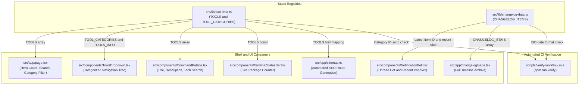

# Tool Catalog & Changelog Synchronization

MegaTools operates as a client-side suite of developer utilities, cryptographic processors, document formatters, and Web3 engines. Rather than maintaining dynamic database tables, content management APIs, or remote microservices, the platform utilizes TypeScript static data modules as its central single source of truth (SSOT):

- **Tool Catalog Registry (`src/lib/tool-data.ts`)**: Defines tool configurations, routes, algorithms, and categorical taxonomy.
- **Changelog History Registry (`src/lib/changelog-data.ts`)**: Stores historical release records, feature rollouts, and bug fixes.

These registries statically propagate throughout the entire Next.js application shell, orchestrating the interactive homepage (`src/app/page.tsx`), the global command palette (`src/components/CommandPalette.tsx`), the navigation dropdown (`src/components/ToolsDropdown.tsx`), dynamic search engine sitemaps (`src/app/sitemap.ts`), and client-side unread indicators (`src/components/NotificationBell.tsx`). Automated verification scripts (`scripts/verify-workflow.mjs`) enforce referential integrity between catalog records and UI consumer expectations.

Related documentation includes the [System Architecture & Shell Overview](/openwiki/architecture/overview.md), the [Automated Verification & Quality Gates](/openwiki/operations/verification.md), and the developer guide for [Adding Tools & Scaffolding Routes](/openwiki/workflows/adding-tools.md).

---

## Platform-Wide Data Synchronization Architecture

The static registries decouple individual tool implementations from platform shell mechanics. Whenever a developer modifies `tool-data.ts` or `changelog-data.ts`, multiple compile-time and runtime consumers synchronize their presentation states automatically.


*Data synchronization flow from static registries to pages, navigation components, SEO endpoints, and automated verification gates.*

---

## Tool Catalog Schema & Data Invariants (`src/lib/tool-data.ts`)

The tool catalog exposes structured metadata and categorization primitives consumed by layout shells, info sidebars, and navigation menus.

### 1. `ToolInfo` Schema

Each utility in MegaTools must adhere to the `ToolInfo` interface:

```typescript
export interface ToolInfo {
  id: string;
  title: string;
  shortTitle: string;
  description: string;
  emoji: string;
  href: string;
  tech: string;
  steps: string[];
  tips: string[];
  example?: { input: string; output: string };
}
```

| Field | Type | Description | Consumer Usage |
| :--- | :--- | :--- | :--- |
| `id` | `string` | Unique slug matching the tool's directory in `src/app/<id>/`. | Used by `<ToolLayout />`, category arrays, and test harnesses. |
| `title` | `string` | Full descriptive display title (e.g., `"CIDR Calculator"`). | Rendered in homepage cards, search listings, and page headers. |
| `shortTitle` | `string` | Abbreviated label (e.g., `"CIDR"`). | Rendered in compact badges and command palette matches. |
| `description` | `string` | Concise synopsis of algorithmic functionality. | Displayed in search results, cards, and metadata tags. |
| `emoji` | `string` | Single visual glyph representing the utility. | Displayed in cards, dropdowns, and browser navigation trees. |
| `href` | `string` | Root-relative route (e.g., `"/cidr-calculator"`). | Next.js navigation anchor targets and sitemap generation. |
| `tech` | `string` | Underlying web technology or algorithm (e.g., `"Bitwise Logic"`, `"WebCrypto API"`). | Displayed in `<TechBadge />` and searchable in palettes. |
| `steps` | `string[]` | Ordered operational instructions. | Rendered in the "How to Use" section of `<InfoPanel />`. |
| `tips` | `string[]` | Practical caveats, shortcuts, or format explanations. | Rendered in the "Tips" section of `<InfoPanel />`. |
| `example` | `{ input; output }` | Optional demonstration payload. | Renders interactive copyable preview boxes in `<InfoPanel />`. |

### 2. Primary Collections & Lookup Tables

- **`TOOLS: ToolInfo[]`**: The comprehensive, ordered array of all registered utilities.
- **`TOOLS_INFO: Record<string, ToolInfo>`**: An indexed dictionary generated via `Object.fromEntries(TOOLS.map((t) => [t.id, t]))`.
- **`getToolInfo(toolId: string): ToolInfo | undefined`**: A constant-time lookup utility querying `TOOLS_INFO[toolId]`. Invoked by `<ToolLayout />` to populate `<InfoPanel />` without iterating over the array.

### 3. Categorical Taxonomy (`ToolCategory`)

Tools are partitioned into 7 distinct functional categories:

```typescript
export interface ToolCategory {
  id: string;
  name: string;
  emoji: string;
  toolIds: string[];
}
```

| Category ID | Name | Emoji | Scope & Focus |
| :--- | :--- | :---: | :--- |
| `pdf-docs` | PDF & Documents | 📄 | Document merging, splitting, watermarking, reorganization, and image conversion. |
| `crypto-security` | Security & Crypto | 🔐 | WebCrypto algorithms, hashing, symmetric encryption, password evaluation, CSP, and certificates. |
| `media-qr` | Media & Audio/Video | 📱 | QR generation/scanning, canvas image processing, screen recording, audio manipulation, and EXIF stripping. |
| `format-text` | Format & Code | 📝 | Code beautifiers, JSON/CSV/YAML transformers, Markdown previewers, AST inspectors, and minifiers. |
| `dev-network` | Dev & Network | ⚙️ | Subnet/CIDR calculators, regex explainer/tester, cron simulators, HAR waterfall inspector, and DNS utilities. |
| `blockchain-web3` | Blockchain & Web3 | ⟠ | Unit conversion (Wei/Gwei/Eth, SOL/Lamports), EIP-55 checksumming, Keccak-256, Merkle trees, and BIP-39 mnemonic generation. |
| `ai-llm` | AI & LLM Tools | 🤖 | Token counting (BPE), diff/hallucination spotters, few-shot prompt formatters, vector similarity, and RAG chunking. |

---

## Dual-Registration Requirement & Category Mapping

MegaTools enforces a **dual-registration invariant** across `src/lib/tool-data.ts`. Creating a route under `src/app/<id>/` and declaring a `ToolInfo` object in `TOOLS` is insufficient on its own:

1. **Catalog Declaration**: The tool must be added to the `TOOLS` array.
2. **Category Mapping**: The tool's unique `id` must be appended to the `toolIds` array of exactly one `ToolCategory` inside `TOOL_CATEGORIES`.

### Concrete Impact of Missing Category Registration

Omitting a tool ID from `TOOL_CATEGORIES` produces silent UI degradation and explicit build verification failures across three critical subsystems:

#### 1. Filter Dropdown and Category Tabs (`src/app/page.tsx`)
On the homepage, category-specific filtering relies on an inverted lookup map compiled via `useMemo`:

```typescript
const categoryToolMap = useMemo(() => {
  const map = new Map<string, string>();
  TOOL_CATEGORIES.forEach((cat) => {
    cat.toolIds.forEach((id) => map.set(id, cat.id));
  });
  return map;
}, []);
```

When evaluating which tools to show:
```typescript
const filtered = useMemo(() => {
  return TOOLS.filter((tool) => {
    const matchesQuery = ...;
    if (!matchesQuery) return false;
    if (selectedCategory === "all") return true;
    return categoryToolMap.get(tool.id) === selectedCategory;
  });
}, [query, selectedCategory, categoryToolMap]);
```

If a tool is omitted from `TOOL_CATEGORIES`, `categoryToolMap.get(tool.id)` returns `undefined`. Consequently, while the tool may appear under `[ALL_PACKAGES]`, selecting any category filter tab (such as `[SECURITY_&_CRYPTO]` or `[DEV_&_NETWORK]`) completely hides the tool from the results, rendering it invisible to users browsing by category.

#### 2. Site-Wide Tools Dropdown Menu (`src/components/ToolsDropdown.tsx`)
The primary navigation dropdown located in the site header does not iterate over `TOOLS`. Instead, it builds its two-column navigation grid by iterating through `TOOL_CATEGORIES`:

```tsx
{TOOL_CATEGORIES.map((category) => (
  <div key={category.id}>
    <span>{category.name}</span>
    {category.toolIds.map((toolId) => {
      const tool = TOOLS_INFO[toolId];
      if (!tool) return null;
      return <Link key={tool.id} href={tool.href}>{tool.title}</Link>;
    })}
  </div>
))}
```

If an entry in `TOOLS` is not mapped in `TOOL_CATEGORIES.toolIds`, it is never traversed by `<ToolsDropdown />`. The utility becomes completely unreachable from the top navigation menu across all pages of the application.

#### 3. Pre-Commit Quality Gate Failure (`scripts/verify-workflow.mjs`)
The repository's automated validation script enforces bidirectional synchronization between `TOOLS` and `TOOL_CATEGORIES` in Gate 2:

```javascript
const categoryToolIds = new Set();
categories.forEach((cat) => cat.toolIds.forEach((id) => categoryToolIds.add(id)));

const toolIds = toolsList.map((t) => t.id);
const missingInCategories = toolIds.filter((id) => !categoryToolIds.has(id));
const missingInTools = Array.from(categoryToolIds).filter((id) => !toolIds.includes(id));

if (missingInCategories.length > 0 || missingInTools.length > 0) {
  // Triggers exit code 1
}
```

A tool missing from either structure immediately trips the validator, outputting:
```
❌ [Category Sync Error] Tools present in TOOLS but missing in TOOL_CATEGORIES:
   - "example-tool"
```
This blocks verification runs and halts deployment pipelines.

---

## Changelog Protocol & Notification Mechanics

Release management, feature communication, and in-app notifications are driven by `src/lib/changelog-data.ts` and `<NotificationBell />`.

### 1. `ChangelogItem` Schema & Categorization

The changelog tracks updates, additions, and enhancements:

```typescript
export type ChangeType = "added" | "updated" | "improved" | "fixed";

export interface ChangelogItem {
  id: string;
  date: string; // YYYY-MM-DD
  title: string;
  type: ChangeType;
  toolHref?: string;
  toolName?: string;
  description: string;
  highlights?: string[];
}
```

- **`id`**: Unique string identifier following the kebab-case format `YYYY-MM-DD-<slug-or-topic>` (e.g., `"2026-09-17-graphql-formatter"`).
- **`date`**: Strict ISO 8601 date string (`YYYY-MM-DD`). Must match the regular expression `^\d{4}-\d{2}-\d{2}$`.
- **`type`**: Semantic change indicator dictating the badge color theme across views:
  - `"added"`: Accent green (`border-accent/40 bg-accent-soft text-accent`) for new utility releases.
  - `"updated"`: Amber warning (`border-warning/40 bg-warning/10 text-warning`) for modified workflows or updated libraries.
  - `"improved"`: Emerald success (`border-success/40 bg-success/10 text-success`) for performance or UX enhancements.
  - `"fixed"`: Red error (`border-error/40 bg-error/10 text-error`) for resolved bugs or regressions.
- **`toolHref` & `toolName`**: Optional references allowing direct navigation to the affected tool from the changelog entry.
- **`highlights`**: Array of concise bullet points detailing specific capabilities or architectural features.

### 2. Chronological Prepend Protocol

The `CHANGELOG_ITEMS` array operates under a strict **prepend invariant**:
- Every new release or tool introduction **must be prepended to the top of `CHANGELOG_ITEMS`** (index 0).
- Appending items to the end of the array or inserting them out of order breaks notification tracking. Because the application evaluates notification state using `CHANGELOG_ITEMS[0]?.id`, non-prepended items fail to register as recent updates.

### 3. Notification State Lifecycle (`src/components/NotificationBell.tsx`)

`<NotificationBell />` is mounted in the global application header (`src/app/layout.tsx`). It manages unread badges and flyout previews using the browser's `localStorage`:

```
User visits site
       │
       ▼
Read localStorage("megatools_last_seen_changelog")
       │
       ├────────────────────────────────────────┐
       │                                        │
lastSeen === CHANGELOG_ITEMS[0]?.id    lastSeen !== CHANGELOG_ITEMS[0]?.id
       │                                        │
       ▼                                        ▼
hasUnread = false                      hasUnread = true
(No badge dot)                         (Render pulsing accent dot)
                                                │
                                                ▼
                                       User clicks Bell button
                                                │
                                                ▼
                                       Open Popover Feed (Top 15 Items)
                                       Write latest ID to localStorage
                                       Set hasUnread = false
```

#### Detailed Operational Phases:

1. **Mount & Unread Evaluation**:
   On client hydration, an effect hook queries `localStorage.getItem("megatools_last_seen_changelog")` and compares it to `CHANGELOG_ITEMS[0]?.id`:
   ```typescript
   useEffect(() => {
     try {
       const lastSeen = localStorage.getItem(STORAGE_KEY);
       const latestId = CHANGELOG_ITEMS[0]?.id;
       if (latestId && lastSeen !== latestId) {
         setHasUnread(true);
       }
     } catch {
       // Gracefully handle restricted iframe/cookie environments
     }
   }, []);
   ```
   If the values do not match (or no entry exists in storage), `hasUnread` becomes `true`.

2. **Visual Unread Indicator**:
   When `hasUnread` is `true`, a relative badge displays in the corner of the bell icon consisting of a solid green dot overlaid on an `animate-ping` pinging halo:
   ```tsx
   {hasUnread && (
     <span className="absolute top-1.5 right-1.5 flex h-2 w-2">
       <span className="animate-ping absolute inline-flex h-full w-full rounded-full bg-accent opacity-75" />
       <span className="relative inline-flex rounded-full h-2 w-2 bg-accent" />
     </span>
   )}
   ```

3. **Popover Activation & Acknowledgment**:
   When the user clicks the bell button, `handleOpen` toggles `isOpen` to `true`. If unread updates are pending, it writes `CHANGELOG_ITEMS[0].id` to `localStorage` under `megatools_last_seen_changelog` and clears `hasUnread`:
   ```typescript
   if (nextState && hasUnread) {
     try {
       const latestId = CHANGELOG_ITEMS[0]?.id;
       if (latestId) {
         localStorage.setItem(STORAGE_KEY, latestId);
       }
       setHasUnread(false);
     } catch {
       // Storage write failure ignored
     }
   }
   ```

4. **Popover Rendering & Event Dismissal**:
   - Renders the 15 most recent entries via `CHANGELOG_ITEMS.slice(0, 15)`.
   - Each entry shows semantic change badges, dates, descriptions, and direct `"open tool →"` links.
   - Global event listeners detect outside clicks (`mousedown`) and `Escape` keypresses (`keydown`) to dismiss the popover immediately.
   - Includes a direct link to the full `/changelog` archive page.

---

## Consumer Integrations: Search, SEO, and Shell Telemetry

The tool registry provides platform-wide telemetry and discovery mechanics across several specialized consumers:

### 1. Dynamic Sitemap Generation (`src/app/sitemap.ts`)
Search engine discovery uses Next.js App Router dynamic sitemap generation. The generator maps directly over `TOOLS`:

```typescript
import type { MetadataRoute } from "next";
import { TOOLS } from "@/lib/tool-data";

export default function sitemap(): MetadataRoute.Sitemap {
  const base = process.env.NEXT_PUBLIC_SITE_URL || "https://megatools-tau.vercel.app";
  const pages = ["", "/about", "/changelog", "/privacy", "/terms", ...TOOLS.map((t) => t.href)];

  return pages.map((path) => ({
    url: `${base}${path}`,
    lastModified: new Date(),
    changeFrequency: "monthly",
    priority: path === "" ? 1.0 : 0.8,
  }));
}
```
Because the route paths are computed dynamically from `TOOLS.map((t) => t.href)`, any newly registered tool is automatically indexed into `/sitemap.xml` upon deployment without editing XML templates.

### 2. Global Command Palette (`src/components/CommandPalette.tsx`)
Invoked globally using `Cmd+K` or `Ctrl+K`, the command palette filters the `TOOLS` array across five distinct fields:

```typescript
const filteredTools = useMemo(() => {
  if (!query) return TOOLS;
  const q = query.toLowerCase();
  return TOOLS.filter(
    (t) =>
      t.title.toLowerCase().includes(q) ||
      t.shortTitle.toLowerCase().includes(q) ||
      t.description.toLowerCase().includes(q) ||
      t.tech.toLowerCase().includes(q) ||
      t.href.toLowerCase().includes(q)
  );
}, [query]);
```
This provides multi-criteria lookup: users can search by tool name, URL slug, description keywords, or underlying technologies (such as `"Bitwise"`, `"WebCrypto"`, or `"Canvas"`).

### 3. Terminal Status Bar Telemetry (`src/components/TerminalStatusBar.tsx`)
Mounted fixed at the bottom of every page, the terminal status bar reads `TOOLS.length` directly to communicate total loaded modules:
```tsx
<span className="text-accent">{TOOLS.length} PKGS</span>
```
This guarantees that the package counter matches the exact number of verified tools in the registry.

---

## Developer Workflows & Quality Assurance

When introducing a new utility to MegaTools, developers follow an integrated workflow to ensure registry consistency:

### 1. Route Scaffolding
Scaffold the tool route using the generator script:
```bash
node scripts/create-tool.mjs <slug> "<Title>" <category-id> "<Tech>"
```
This generates:
- `src/app/<slug>/page.tsx`: Server component with canonical SEO metadata.
- `src/app/<slug>/<PascalName>Client.tsx`: Client component pre-wired with `<ToolLayout />` and standard toolbars.

### 2. Dual-Registry Entry in `src/lib/tool-data.ts`
1. Append the `ToolInfo` object to `TOOLS`:
   ```typescript
   {
     id: "my-tool",
     title: "My New Tool",
     shortTitle: "MyTool",
     description: "Comprehensive in-browser processing utility.",
     emoji: "⚡",
     href: "/my-tool",
     tech: "WebCrypto API",
     steps: ["Input payload", "Configure parameters", "Export output"],
     tips: ["All processing occurs in local RAM."],
     example: { input: "test", output: "TEST" },
   }
   ```
2. Locate the appropriate category in `TOOL_CATEGORIES` and append `"my-tool"` to its `toolIds` array.

### 3. Changelog Announcement in `src/lib/changelog-data.ts`
Prepend a release record to the beginning of `CHANGELOG_ITEMS`:
```typescript
{
  id: "2026-09-24-my-tool",
  date: "2026-09-24",
  title: "My New Tool: Client-Side Engine",
  type: "added",
  toolHref: "/my-tool",
  toolName: "My New Tool",
  description: "Perform high-speed processing directly inside browser memory.",
  highlights: [
    "100% client-side execution with zero telemetry",
    "Real-time processing feedback",
  ],
},
```

### 4. Automated Verification Gate
Execute the automated validator prior to committing:
```bash
npm run verify
```
This executes:
1. `<ToolLayout />` coverage check across all directories in `src/app/`.
2. Bidirectional synchronization check between `TOOLS` and `TOOL_CATEGORIES`.
3. Non-empty check and ISO date format validation on `CHANGELOG_ITEMS`.
4. Full type checking via `tsc --noEmit`.
