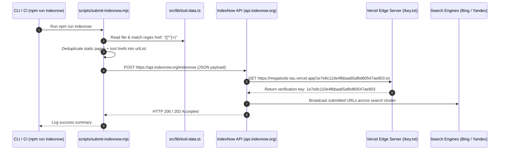

# Deployment, SEO & IndexNow Protocol

MegaTools is engineered as an in-browser utility suite operating entirely under a zero-server processing model. The application builds on Next.js 16 (App Router with Turbopack) and React 19, deploying directly to Vercel as a globally distributed static edge application with no dynamic backend databases or microservices.

Search indexing and discoverability rely on three synchronized layers: Next.js Metadata Route APIs (`src/app/sitemap.ts` and `src/app/robots.ts`), RootLayout JSON-LD structured data (`src/app/layout.tsx`), and automated multi-engine indexing dispatch via IndexNow (`scripts/submit-indexnow.mjs`).

---

## Deployment Architecture & Build Optimization

MegaTools compiles through Next.js static asset pipelines to deploy on Vercel's global edge network. Because every tool runs 100% inside client-side browser memory, the application has no requirement for persistent server infrastructure, databases, remote workers, or session stores.

```mermaid
flowchart TD
    subgraph Source ["Source Repository"]
        Code["TypeScript / React 19\n(src/app, src/components, src/lib)"]
        Configs["next.config.ts\ntsconfig.json\neslint.config.mjs"]
        Scripts["scripts/verify-workflow.mjs\nscripts/submit-indexnow.mjs"]
    end

    subgraph CI ["CI & Build Pipeline"]
        Verify["npm run verify\n(Quality Gate & Registry Sync)"]
        Build["npm run build\n(next build / Static Generation)"]
        Lint["npm run lint\n(eslint-config-next)"]
    end

    subgraph VercelEdge ["Vercel Edge Platform"]
        CDN["Vercel CDN Edge Network\n(megatools-tau.vercel.app)"]
        AnalyticsEdge["@vercel/analytics & @vercel/speed-insights"]
        StaticAssets["Static HTML, JS Bundles, CSS\npublic/ & Static Route Shells"]
        KeyToken["IndexNow Verification Token\n(/1e7e8c110e4fbbaa65afbd80547ae803.txt)"]
    end

    subgraph SearchEngines ["Search Engines & Indexing"]
        Bing["Bing / IndexNow Hub\n(api.indexnow.org)"]
        Yandex["Yandex / Partner Crawlers"]
        Google["Google Search / Search Console"]
    end

    Code --> Verify
    Verify --> Build
    Configs --> Build
    Build --> CDN
    CDN --> StaticAssets
    CDN --> KeyToken
    CDN --> AnalyticsEdge

    Scripts -->|"npm run indexnow\n(POST JSON payload)"| Bing
    Bing -->|"Key Location Verification GET"| KeyToken
    Bing --> Yandex
    Google -->|"Crawl sitemap.xml & robots.txt"| CDN
```


*End-to-end build, Vercel edge deployment, and search engine submission lifecycle.*

### 1. Build Pipeline & Tooling
The deployment and build configuration leverages modern Next.js App Router capabilities:
- **Framework & Compiler**: Next.js 16 with React 19 and Turbopack compiler (`next dev`, `next build`, `next start` defined in `package.json`).
- **Strict Static Type Checking**: TypeScript 5 configured with strict mode and `noEmit: true` in `tsconfig.json`. Quality gates run `npx tsc --noEmit` before production deployment.
- **Styling Pipeline**: Tailwind CSS v4 using PostCSS (`@tailwindcss/postcss` and `tailwindcss` v4) to compile dark terminal utility classes into atomic static stylesheets.
- **Zero-Server Invariant**: Every tool directory in `src/app/[tool-slug]/` houses a server page component (`page.tsx`) that exports static SEO metadata and renders a client component (`[Tool]Client.tsx`) marked with `'use client'`. No server actions, no `route.ts` API endpoints, and no server runtime data transformations exist.

### 2. Vercel Hosting & Runtime Telemetry
The production target hostname is `megatools-tau.vercel.app`. The platform integrates runtime performance and telemetry packages directly in the root layout (`src/app/layout.tsx`):
- `@vercel/analytics/next`: Captures real-time visitor metrics without collecting user data or tool payload inputs.
- `@vercel/speed-insights/next`: Collects Core Web Vitals (LCP, FID/INP, CLS) from client browser runs.
- `@next/third-parties/google`: Conditionally mounts Google Analytics when the environment variable `process.env.NEXT_PUBLIC_GA_ID` is present.

---

## SEO Architecture & Metadata Generation

Discoverability across search engines relies on static-route metadata generation, standardized OpenGraph attributes, dynamic XML sitemaps, and robots directives.

### 1. RootLayout Metadata & Schema.org JSON-LD (`src/app/layout.tsx`)
The global shell defines application-wide search parameters in `metadata`:
- **Base URL Resolution**: `metadataBase: new URL("https://megatools-tau.vercel.app")` ensures all relative paths across subroutes resolve to canonical production URLs.
- **Title and Description**: Default fallback title `"MegaTools — Free Online Tools for Everyone"` and privacy-focused utility descriptions.
- **Webmaster Verification**: Embeds search engine validation tokens directly into HTML headers:
  - Google Search Console: `google: "VNK6qw2Ov-15QBCr5sZYMYncz4GzXBmqcf1OZwBq2WE"`
  - Bing Webmaster Tools: `msvalidate.01: "159693DE9D1C37F10F7D3CA001F1B281"`
- **Structured Data (`WebApplication`)**: Injects an inlined `application/ld+json` script tag adhering to Schema.org standards:
  - `@context`: `"https://schema.org"`
  - `@type`: `"WebApplication"`
  - `name`: `"MegaTools"`
  - `url`: `"https://megatools-tau.vercel.app"`
  - `applicationCategory`: `"UtilityApplication"`
  - `operatingSystem`: `"All"`
  - `offers`: `{ "@type": "Offer", price: "0" }`

### 2. Tool Route Metadata Standard (`src/app/[tool-slug]/page.tsx`)
Every utility route server component exports an explicit `Metadata` configuration conforming to the MegaTools architectural standard:
- Unique `title` formatted as `"<Tool Name> — MegaTools"`.
- Targeted `description` highlighting client-side execution, key conversion features, and privacy guarantees.
- Exhaustive `keywords` array matching high-intent search queries.
- `openGraph` object mirroring title and description for social previews.
- Explicit `alternates` declaration with `canonical: "/<tool-slug>"`.

### 3. Dynamic Sitemap Generation (`src/app/sitemap.ts`)
Next.js dynamically compiles `/sitemap.xml` via the App Router `MetadataRoute.Sitemap` handler:

```ts
import type { MetadataRoute } from "next";
import { TOOLS } from "@/lib/tool-data";

export default function sitemap(): MetadataRoute.Sitemap {
  const base =
    process.env.NEXT_PUBLIC_SITE_URL || "https://megatools-tau.vercel.app";
  const pages = ["", "/about", "/changelog", "/privacy", "/terms", ...TOOLS.map((t) => t.href)];

  return pages.map((path) => ({
    url: `${base}${path}`,
    lastModified: new Date(),
    changeFrequency: "monthly",
    priority: path === "" ? 1.0 : 0.8,
  }));
}
```

- **Base URL Fallback**: Resolves `process.env.NEXT_PUBLIC_SITE_URL` if set; defaults to `"https://megatools-tau.vercel.app"`.
- **Registry Synchronization**: Iterates across static utility pages (`""`, `/about`, `/changelog`, `/privacy`, `/terms`) combined with all tool routes derived from `TOOLS.map((t) => t.href)`. When a tool is added to `src/lib/tool-data.ts`, it is automatically incorporated into the sitemap upon deployment.
- **Priority and Frequency**: Homepage (`""`) receives `priority: 1.0`; all subpages and tool routes receive `priority: 0.8`. All entries assign `changeFrequency: "monthly"` and dynamic `lastModified` timestamps.

### 4. Search Engine Crawler Directives (`src/app/robots.ts`)
The `robots.txt` output is dynamically generated using Next.js `MetadataRoute.Robots`:

```ts
import type { MetadataRoute } from "next";

export default function robots(): MetadataRoute.Robots {
  const base =
    process.env.NEXT_PUBLIC_SITE_URL || "https://megatools-tau.vercel.app";
  return {
    rules: { userAgent: "*", allow: "/" },
    sitemap: `${base}/sitemap.xml`,
  };
}
```

- Permits full indexing across all search engine user agents (`userAgent: "*", allow: "/"`).
- Directs bots directly to the dynamic XML sitemaps endpoint (`${base}/sitemap.xml`).

---

## IndexNow Submission Protocol (`scripts/submit-indexnow.mjs`)

The IndexNow protocol enables instant search engine notification (Bing, Yandex, Seznam, Naver) whenever pages are added, modified, or refreshed, bypassing crawl queues and manual sitemap pinging.


*IndexNow automated discovery, validation, and multi-engine indexing sequence.*

### 1. Protocol Architecture & Payload Parameters
The automation script (`scripts/submit-indexnow.mjs`) defines the host and cryptographic verification key:
- `HOST`: `"megatools-tau.vercel.app"`
- `KEY`: `"1e7e8c110e4fbbaa65afbd80547ae803"`
- `KEY_LOCATION`: `"https://megatools-tau.vercel.app/1e7e8c110e4fbbaa65afbd80547ae803.txt"`

The static verification file exists in the public directory at `public/1e7e8c110e4fbbaa65afbd80547ae803.txt` containing only the raw key string. When IndexNow receives a submission payload, it validates domain ownership by executing an HTTP GET request to `keyLocation`.

The payload submitted to `https://api.indexnow.org/indexnow`:
```json
{
  "host": "megatools-tau.vercel.app",
  "key": "1e7e8c110e4fbbaa65afbd80547ae803",
  "keyLocation": "https://megatools-tau.vercel.app/1e7e8c110e4fbbaa65afbd80547ae803.txt",
  "urlList": [
    "https://megatools-tau.vercel.app",
    "https://megatools-tau.vercel.app/about",
    "https://megatools-tau.vercel.app/changelog",
    "https://megatools-tau.vercel.app/privacy",
    "https://megatools-tau.vercel.app/terms",
    "https://megatools-tau.vercel.app/qrcode",
    "..."
  ]
}
```

### 2. URL Extraction & Regex Parsing Mechanism
Unlike `src/app/sitemap.ts` which imports `TOOLS` as an ESM module, `scripts/submit-indexnow.mjs` extracts tool routes via direct filesystem read and regular expression pattern matching:
```javascript
const toolDataPath = path.resolve(__dirname, "../src/lib/tool-data.ts");
const toolDataContent = fs.readFileSync(toolDataPath, "utf-8");
const hrefMatches = [...toolDataContent.matchAll(/href:\s*"([^"]+)"/g)].map((m) => m[1]);

const staticPages = ["", "/about", "/changelog", "/privacy", "/terms"];
const allPaths = Array.from(new Set([...staticPages, ...hrefMatches]));
const urlList = allPaths.map((p) => `https://${HOST}${p}`);
```
This regex approach avoids Node.js ESM compilation/transpilation issues when executing standalone Node `.mjs` scripts outside of Next.js or TypeScript loaders.

### 3. Execution & HTTP Response Handling
To dispatch index updates following a release or tool addition, execute:
```bash
npm run indexnow
```
The script posts the JSON payload with `Content-Type: application/json; charset=utf-8` to `https://api.indexnow.org/indexnow`:
- **Success (HTTP 200 / 202)**: Logs successful submission of the URL batch to Bing, Yandex, and participating search engines.
- **Errors / Warnings**: Captures non-200/202 status codes, logs the response body, and catches network or connection faults.

---

## Operational Verification & Pre-Deployment Checklist

Before merging and deploying changes to production, developers and automated agents execute verification steps to ensure SEO metadata, registry synchronization, and build outputs remain clean:

1. **Quality Gate Verification**:
   ```bash
   npm run verify
   ```
   Ensures 100% `<ToolLayout />` wrapper usage, category mapping parity in `src/lib/tool-data.ts`, and valid ISO dates in `src/lib/changelog-data.ts`.
2. **TypeScript Compilation Check**:
   ```bash
   npx tsc --noEmit
   ```
   Guarantees zero static typing mismatches in routes, metadata declarations, or client components.
3. **Production Build Validation**:
   ```bash
   npm run build
   ```
   Validates that Next.js static site generation succeeds without dynamic runtime errors.
4. **Search Index Dispatch**:
   ```bash
   npm run indexnow
   ```
   Submits newly added tool URLs immediately to IndexNow crawlers upon production rollout.
