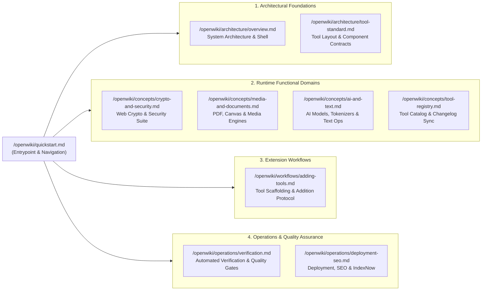

# Quickstart & Routing Guide

MegaTools is a client-side suite of 92+ browser-native utilities spanning developer tooling, client-side cryptography, multimedia processing, document manipulation, blockchain primitives, and artificial intelligence utilities. The platform enforces an absolute zero-server processing model: all calculations, conversions, parsers, and cryptographic derivations execute exclusively in the client's browser memory (RAM), guaranteeing zero data leakage to external networks or servers.

This guide provides the primary entry point for developers and autonomous coding agents. It details the runtime foundation, UI terminal styling standards, essential development and validation commands, the mandatory 6-step extension protocol, and a comprehensive routing index across the complete MegaTools documentation suite.

---

## System Architecture & Design Language

MegaTools is built on the Next.js 16 App Router and React 19, styled using Tailwind CSS v4. Instead of client-server RPCs or edge compute pipelines, tools run as self-contained client components sandboxed in the browser runtime.

<!-- openwiki: mermaid parse failed and this diagram was converted to a text fence so it does not break rendering. Fix the diagram source and restore the mermaid fence. Parser error: Heuristic: an unescaped angle bracket inside a label breaks rendering; rephrase the label. -->
```text
flowchart TD
    subgraph BrowserShell ["Client Browser Runtime Shell"]
        RootLayout["RootLayout (src/app/layout.tsx)"]
        Header["Header Shell (Navigation, QuickSwitchBar, CrtToggle, NotificationBell)"]
        ToolRoute["Tool Page (/src/app/[slug]/)"]
        StatusBar["TerminalStatusBar (Session, Heap MB, Package Count)"]
    end

    subgraph ToolComponent ["Standard Tool Composition"]
        Page["page.tsx (Server Component: SEO Metadata)"]
        Client["[Tool]Client.tsx ('use client')"]
        Layout["<ToolLayout /> (Chrome, Breadcrumbs, Terminal Badge)"]
        Workspace["Workspace (8 Columns: Input/Output Cards, Monospace Toolbar)"]
        Sidebar["Desktop <InfoPanel /> / <MobileInfoDrawer /> (4 Columns)"]
    end

    subgraph StaticSSOT ["Static Data SSOT (src/lib/)"]
        ToolData["tool-data.ts (TOOLS & TOOL_CATEGORIES)"]
        ChangelogData["changelog-data.ts (CHANGELOG_ITEMS)"]
    end

    RootLayout --> Header
    RootLayout --> ToolRoute
    RootLayout --> StatusBar
    ToolRoute --> Page
    Page --> Client
    Client --> Layout
    Layout --> Workspace
    Layout --> Sidebar
    Sidebar --> ToolData
    Header --> ChangelogData
```
*Architectural layout and data-flow hierarchy of the MegaTools browser shell and tool components.*

### Core Architectural Invariants

1. **Zero-Server Processing Privacy Model**:
   Payloads, files, passwords, private keys, and query inputs never leave the user's machine. Network requests are strictly limited to initial static asset delivery, client-side analytics (`@vercel/analytics`), and opt-in third-party public API queries (such as public DNS-over-HTTPS or RDAP lookups in Dev & Network tools). Tools function fully offline once cached.
2. **Next.js 16 & React 19 Client Execution**:
   Routes follow the Next.js App Router structure under `src/app/<tool-slug>/`. The route entrypoint (`page.tsx`) acts as a lightweight Server Component exporting static `Metadata` (including canonical URL, title, description, and OpenGraph tags) and rendering the interactive companion component (`<ToolName>Client.tsx`).
3. **Retro Terminal & Monospace UI Language**:
   The interface uses a dark cyberpunk terminal visual theme:
   - Base canvas: `#0a0f0d` (`--color-bg-page`) with elevated cards at `#101713` (`--color-bg-card`).
   - Accent highlights: Terminal emerald `#4ade80` (`--color-accent`) with subtle green glow effects (`--color-accent-soft`).
   - Monospace typography: Geist Mono (`--font-mono`) and JetBrains Mono (`--font-jetbrains`).
   - Command prompt headers: `[megatools]$ ✦` branding and active tool badges (`$ megatools --<tool-slug> --client-side █`).
   - CRT Scanline Mode: An integrated CRT display toggle (`<CrtToggle />`) injects the `.crt-active` class onto the root HTML element and persists state in `localStorage` under `megatools_crt_mode`.
4. **Tool Layout Standard (`<ToolLayout />`)**:
   Individual tool workspaces must not construct custom page headers, breadcrumbs, or responsive drawers. Instead, every client component wraps its workspace inside `<ToolLayout />` (`src/components/ToolLayout.tsx`), which provides a 12-column responsive grid (8 columns for workspace controls, 4 columns for `<InfoPanel />`), top breadcrumbs (`← [cd .. / home]`), and the `<MobileInfoDrawer />` for small viewports.

---

## Developer Quickstart & CLI Commands

MegaTools provides a minimal set of scripts defined in `package.json` for development, tool creation, verification, and deployment.

### Essential Commands

| Command | Script Invocation | Primary Purpose |
| :--- | :--- | :--- |
| `npm run dev` | `next dev` | Launches local development server at `http://localhost:3000` with Turbopack fast refresh. |
| `npm run verify` | `node scripts/verify-workflow.mjs` | Runs the automated 4-phase verification gate (ToolLayout coverage, registry dual-sync, changelog format, TypeScript typecheck). |
| `npm run make:tool` | `node scripts/create-tool.mjs` | Scaffolds a new tool route (`page.tsx` + `*Client.tsx`) adhering to `<ToolLayout />` standards. |
| `npm run build` | `next build` | Compiles the production Next.js static edge bundle and validates compile-time page generation. |
| `npm run lint` | `eslint` | Executes ESLint across all TypeScript and React source files using `eslint-config-next`. |
| `npm run indexnow` | `node scripts/submit-indexnow.mjs` | Dispatches all route URLs from `tool-data.ts` to the IndexNow search indexing hub (Bing, Yandex). |

### Scaffolding New Tools

To create a new tool route, execute the scaffolding script:

```bash
npm run make:tool <tool-slug> "<Tool Title>" <category-id> "<Tech>"
```

Example:
```bash
npm run make:tool csp-builder "Content Security Policy Builder" crypto-security "CSP AST Engine"
```

The script performs the following actions:
1. Validates that `src/app/<tool-slug>/` does not already exist.
2. Creates `src/app/<tool-slug>/page.tsx` with full SEO metadata export and canonical link.
3. Creates `src/app/<tool-slug>/<ToolName>Client.tsx` pre-wired with `<ToolLayout />`, a metric stats sidebar, input/output card containers, and standard `h-8 flex items-center justify-between` action headers.

---

## Mandatory 6-Step Tool Addition Protocol

Every developer or agent introducing a new tool must adhere strictly to the **Zero-Mistake Protocol** outlined in `AGENTS.md` and `ARCHITECTURE.md`:

<!-- openwiki: mermaid parse failed and this diagram was converted to a text fence so it does not break rendering. Fix the diagram source and restore the mermaid fence. Parser error: Heuristic: an unescaped angle bracket inside a label breaks rendering; rephrase the label. -->
```text
flowchart TD
    S1["1. Plan & Confirm\nDefine specs, client engine, and UI breakdown"] --> S2["2. Scaffold Route\nnpm run make:tool <slug> '<Title>' <category> '<Tech>'"]
    S2 --> S3["3. Implement Client Logic\nComplete *Client.tsx with <ToolLayout /> & in-memory processing"]
    S3 --> S4["4. Dual Registry Sync\nRegister in TOOLS and TOOL_CATEGORIES in src/lib/tool-data.ts"]
    S4 --> S5["5. Changelog & Notification\nPrepend to CHANGELOG_ITEMS in src/lib/changelog-data.ts"]
    S5 --> S6["6. Verify & Document\nUpdate README.md table and pass npm run verify"]
    S6 --> Commit["Ready to Commit\ngit commit --no-gpg-sign"]
```
*Mandatory six-step implementation and synchronization workflow for adding or updating tools.*

1. **Plan & Confirm First**: Define the tool slug, target category, computation engine (e.g. Web Crypto, Canvas API, `pdf-lib`), input/output controls, and performance characteristics before authoring code.
2. **Scaffold Route & Layout**: Generate template files via `npm run make:tool`. Never write custom page headers, back links, or mobile drawers; rely entirely on `<ToolLayout />`. Internal cards must use `h-8 flex items-center justify-between` header bars with monospace buttons.
3. **Implement Client Workspace**: Place all transformation logic in client-side memory. Ensure zero external HTTP exfiltration occurs.
4. **Dual Registry Synchronization (`src/lib/tool-data.ts`)**:
   - Register the complete tool schema in `TOOLS` (`id`, `title`, `shortTitle`, `description`, `emoji`, `href`, `tech`, `steps`, `tips`, `example`).
   - Add the tool's `id` to the matching category's `toolIds` array in `TOOL_CATEGORIES`. **Omitting this step causes the tool to be omitted from homepage grids and search filters.**
5. **Changelog & Notification Bell (`src/lib/changelog-data.ts`)**:
   - Prepend a new `ChangelogItem` entry to the top of `CHANGELOG_ITEMS`.
   - The `date` property must use the real current ISO date (`YYYY-MM-DD`). This triggers the unread notification dot in `<NotificationBell />` and updates `/changelog`.
6. **Documentation & Quality Gate**:
   - Add the tool row to the matching category table in `README.md` and update category counts.
   - Run `npm run verify` to pass the 4-phase audit. Fix any TypeScript errors reported by `tsc --noEmit`.

---

## Documentation & Routing Index

MegaTools documentation is organized into four distinct operational layers across architecture, functional domains, workflows, and deployment operations. Use this routing map to navigate directly to the appropriate specification:


*Routing map connecting developer entrypoints to the complete MegaTools documentation suite.*

### Detailed Documentation Routing Table

| Layer | Wiki Page Path | Page Title | Primary Scope & Responsibilities | When to Read |
| :--- | :--- | :--- | :--- | :--- |
| **Architecture** | `/openwiki/architecture/overview.md` | [System Architecture & Shell Overview](/openwiki/architecture/overview.md) | Next.js 16 App Router hierarchy, RootLayout chrome, BootSplash sequence, QuickSwitchBar (Cmd+K) command palette, TerminalStatusBar heap metrics, and CRT scanline styling. | When modifying the global application shell, navigation bars, footer status bars, or theme styles. |
| **Architecture** | `/openwiki/architecture/tool-standard.md` | [Tool Layout Standard & Component Contracts](/openwiki/architecture/tool-standard.md) | Single Source of Truth layout standard via `<ToolLayout />`, 12-column responsive grid rules, InfoPanel props contract, `h-8` card toolbar standards, and zero-server privacy invariants. | When building, updating, or reviewing individual tool UIs and layout components. |
| **Domain** | `/openwiki/concepts/crypto-and-security.md` | [Client-Side Cryptography & Security Suite](/openwiki/concepts/crypto-and-security.md) | Web Crypto API implementations (AES-GCM, HMAC, PBKDF2, RSA/ECDSA keypairs), Web3 utilities (EIP-55, Keccak-256, Merkle trees, BIP-39), and password/secret analysis. | When implementing cryptographic algorithms, security tools, hashing utilities, or blockchain converters. |
| **Domain** | `/openwiki/concepts/media-and-documents.md` | [Media Processing & Document Engines](/openwiki/concepts/media-and-documents.md) | Client-side document engines (`pdf-lib` merge, split, watermark, page reordering), HTML5 Canvas image compressors/converters, Web Audio tone generation, and QR code encoders/decoders. | When working with document manipulation, image scaling/compression, audio trimming, or QR utilities. |
| **Domain** | `/openwiki/concepts/ai-and-text.md` | [AI, LLM, and Code Utilities](/openwiki/concepts/ai-and-text.md) | AI model comparisons (context windows, pricing tiers), token counter heuristics, prompt templates, RAG chunking, formatters (JSON, SQL, GraphQL, YAML), and string transformers. | When authoring prompt engineering tools, text parsers, code beautifiers, diff checkers, or AI calculators. |
| **Domain** | `/openwiki/concepts/tool-registry.md` | [Tool Catalog & Changelog Synchronization](/openwiki/concepts/tool-registry.md) | Data schemas in `src/lib/tool-data.ts` and `src/lib/changelog-data.ts`, categorization rules, sitemap generation, search index propagation, and notification bell state. | When registering new tools, editing categories, modifying changelog releases, or troubleshooting search indexing. |
| **Workflow** | `/openwiki/workflows/adding-tools.md` | [Tool Creation & Scaffolding Workflow](/openwiki/workflows/adding-tools.md) | Step-by-step developer protocol for scaffolding via `scripts/create-tool.mjs`, client component authoring, registry dual-registration, changelog logging, and README updates. | When adding a new tool to the repository from scratch or refactoring an existing route. |
| **Operations** | `/openwiki/operations/verification.md` | [Automated Verification & Quality Gates](/openwiki/operations/verification.md) | Automated pre-commit verification via `scripts/verify-workflow.mjs` (`npm run verify`), covering `<ToolLayout />` auditing, registry referential integrity, changelog dates, and `tsc`. | When running automated checks, investigating CI failures, or diagnosing pre-commit gate errors. |
| **Operations** | `/openwiki/operations/deployment-seo.md` | [Deployment, SEO & IndexNow Protocol](/openwiki/operations/deployment-seo.md) | Vercel edge deployment configuration, static sitemap generation (`src/app/sitemap.ts`), robots.txt, structured JSON-LD data, and automated search engine submission (`scripts/submit-indexnow.mjs`). | When configuring production deployments, modifying SEO tags, or submitting batch URLs to IndexNow. |

---

## Quality Gate Audits & Common Pitfalls

The automated quality gate `npm run verify` (`scripts/verify-workflow.mjs`) validates four sequential phases before any change is committed:

1. **Phase 1: `<ToolLayout />` Coverage**: Scans all `src/app/*` directories (excluding static informational routes `about`, `privacy`, `terms`, and `changelog`). Confirms a `*Client.tsx` file exists and explicitly includes `<ToolLayout`.
2. **Phase 2: Bidirectional Registry Synchronization**: Confirms that every `id` in the `TOOLS` list in `src/lib/tool-data.ts` is present in at least one category in `TOOL_CATEGORIES`, and that no orphan IDs exist in `TOOL_CATEGORIES`.
3. **Phase 3: Changelog Integrity & ISO Date Format**: Confirms `CHANGELOG_ITEMS` in `src/lib/changelog-data.ts` is non-empty and every item uses strict `YYYY-MM-DD` formatting matching `/^\d{4}-\d{2}-\d{2}$/`.
4. **Phase 4: Static Type Check**: Executes `npx tsc --noEmit` and asserts zero TypeScript compilation errors.

### Common Pitfalls and Solutions

| Symptom | Root Cause | Remediation |
| :--- | :--- | :--- |
| Tool missing from homepage and category filters | Tool registered in `TOOLS` array in `tool-data.ts` but omitted from `TOOL_CATEGORIES.toolIds`. | Add the tool slug to the appropriate category's `toolIds` array in `src/lib/tool-data.ts`. |
| `npm run verify` fails on Phase 1 | Tool client component authored without wrapping in `<ToolLayout />`, or custom outer header used. | Wrap the client component root in `<ToolLayout toolId="<slug>" stats={stats}>` and remove custom headers. |
| Verification fails with `[Changelog Date Error]` | Arbitrary text, timestamp, or slash-separated date used in `changelog-data.ts`. | Format `date` as `YYYY-MM-DD` using `new Date().toISOString().split('T')[0]`. |
| `tsc --noEmit` fails on Next.js metadata | Exporting client hooks or client directives inside `src/app/<slug>/page.tsx`. | Keep `page.tsx` as a pure Server Component exporting `metadata` and importing `<ToolName>Client`. |
| Broken toolbar UI in dark theme | Custom card header styles instead of standard classnames. | Ensure card headers strictly use `h-8 flex items-center justify-between` with font-mono button controls. |
