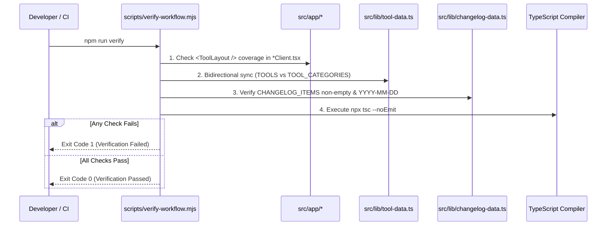

# Tool Creation & Scaffolding Workflow

MegaTools enforces a standardized six-step protocol known as the **Zero-Mistake Protocol** for authoring, implementing, registering, and validating every tool. This protocol ensures 100% client-side privacy, strict UI consistency via `<ToolLayout />`, bidirectional registry synchronization across navigation and search, and automated verification before deployment.

<!-- openwiki: mermaid parse failed and this diagram was converted to a text fence so it does not break rendering. Fix the diagram source and restore the mermaid fence. Parser error: Heuristic: an unescaped angle bracket inside a label breaks rendering; rephrase the label. -->
```text
flowchart TD
    Step1["Step 1: Plan & Confirm\nDefine features, tech engine, and UI breakdown"] --> Step2["Step 2: Scaffolding CLI\nnpm run make:tool <slug> '<Title>' <category> '<Tech>'"]
    Step2 --> FilesGen["Generated Files:\n- src/app/<slug>/page.tsx (SEO Metadata)\n- src/app/<slug>/<ToolName>Client.tsx (<ToolLayout />)"]
    FilesGen --> Step3["Step 3: Dual Registry Sync\nRegister in src/lib/tool-data.ts\n(TOOLS + TOOL_CATEGORIES.toolIds)"]
    Step3 --> Step4["Step 4: Changelog Entry\nPrepend to src/lib/changelog-data.ts\n(CHANGELOG_ITEMS with ISO YYYY-MM-DD date)"]
    Step4 --> Step5["Step 5: Documentation\nAdd row to matching category table in README.md"]
    Step5 --> Step6["Step 6: Verification Gate\nRun npm run verify\n(ToolLayout + Category Sync + Changelog + tsc --noEmit)"]
    Step6 --> Done["Complete & Ready to Commit"]
```
*End-to-end authoring and validation workflow for new tools.*

---

## 1. CLI Scaffolding Usage

The CLI generator scaffolds a standardized Next.js App Router route and client workspace component adhering to the terminal aesthetic and `<ToolLayout />` layout standards.

### Command Syntax

```bash
npm run make:tool <slug> "<Title>" <category> "<Tech>"
```

Direct script invocation:
```bash
node scripts/create-tool.mjs <slug> "<Title>" <category> "<Tech>"
```

### CLI Parameters & Defaults

`scripts/create-tool.mjs` parses arguments from `process.argv`:

| Parameter | Positional Index | Default Value | Description |
| :--- | :--- | :--- | :--- |
| `<slug>` | 0 | *Required* | Lowercase, hyphen-delimited directory and tool identifier (e.g. `csp-builder`). |
| `"<Title>"` | 1 | Title-cased slug words | Human-readable tool title (e.g. `"Content Security Policy Builder"`). |
| `<category>` | 2 | `"dev-network"` | Category ID matching `TOOL_CATEGORIES` in `src/lib/tool-data.ts`. |
| `"<Tech>"` | 3 | `"Web Standards API"` | Primary web API, parser, or cryptographic engine used for computation. |

If `src/app/<slug>` already exists, the script halts with an error (`Directory already exists at ...`) to prevent accidental overwrites.

### Generated Files

The script writes two files into `src/app/<slug>/`:

1. **`page.tsx`**: Server component defining Next.js `Metadata` and rendering the client companion.
2. **`<ToolName>Client.tsx`**: Client component (`"use client"`) wrapping interactive state in `<ToolLayout />`.

---

## 2. Mandatory Six-Step Zero-Mistake Protocol

Every developer or AI agent adding, updating, or refactoring a tool must strictly execute these six sequential steps:

### Step 1: Plan & Confirm First
- Present an implementation plan detailing features, client-side engine (e.g. Web Crypto, Canvas API, pure regex/AST parsing), and UI layout breakdown before writing code.
- Confirm zero server dependencies: user data must never leave browser RAM.

### Step 2: Scaffolding & Layout Standard (`<ToolLayout />`)
- Run `npm run make:tool <slug> "<Title>" <category> "<Tech>"`.
- Inspect and refine `src/app/<slug>/page.tsx`:
  - Verify complete SEO `Metadata`: `title: "<Tool Title> — MegaTools"`, `description`, `keywords`, `alternates: { canonical: "/<slug>" }`, and `openGraph`.
- Inspect and implement `src/app/<slug>/<ToolName>Client.tsx`:
  - Must wrap the entire interactive UI inside `<ToolLayout toolId="<slug>" stats={stats}>`.
  - **Never** write custom outer page headers, custom back links, or custom mobile drawers; `<ToolLayout />` provides the `$ megatools --<slug> --client-side █` terminal badge, home navigation (`← [cd .. / home]`), desktop `<InfoPanel />`, and slide-in `<MobileInfoDrawer />`.
  - Inside card containers, header bars must strictly follow the standard toolbar convention: `h-8 flex items-center justify-between` with monospace action buttons (e.g. `[Clear]` and `<CopyButton />`).
  - Zero Leakage: 100% client-side execution in browser RAM.

### Step 3: Tool Registry & Category Sync (Dual Registration)
In `src/lib/tool-data.ts`, register the new tool in **two distinct locations**:
1. **`TOOLS` Array**: Append a complete `ToolInfo` object:
   ```typescript
   {
     id: "my-tool",
     title: "My Tool Title",
     shortTitle: "My Tool",
     description: "Concise summary of tool functionality and client privacy.",
     emoji: "🔧",
     href: "/my-tool",
     tech: "Web Crypto API",
     steps: ["Input data", "Select options", "Copy output"],
     tips: ["Helpful practical caveat or advice"],
     example: { input: "sample input", output: "sample output" },
   }
   ```
2. **`TOOL_CATEGORIES` Array**: Append `"my-tool"` to the `toolIds` array of the target category.
   - **Critical**: Omitting `tool.id` from `TOOL_CATEGORIES` leaves the tool invisible on the homepage grid, category tabs, and search dropdown filters.

### Step 4: Changelog & Notification Bell ("What's New")
In `src/lib/changelog-data.ts`:
- Prepend a new `ChangelogItem` entry to the **top** of the `CHANGELOG_ITEMS` array.
- **Date Rule**: The `date` field must strictly use the real current system ISO date string (`YYYY-MM-DD` matching `new Date().toISOString().split('T')[0]`). Never hardcode past or arbitrary placeholder dates.
- Setting a valid release entry directly triggers the unread indicator badge in `<NotificationBell />` and publishes the entry to `/changelog`.

### Step 5: Documentation & README Update
- Add a new row describing the tool, route, engine, and summary to the matching category table in `README.md`.
- Increment the category count header and the top-level total tools count in `README.md` if necessary.

### Step 6: Verification Gate
- Run automated validation and static type checking:
  ```bash
  npm run verify
  ```
  or manually run:
  ```bash
  npx tsc --noEmit
  ```
- In git-confined environments, commit using `git commit --no-gpg-sign -m "..."`.

---

## 3. Scaffolding Anatomy & Generated Code

### Server Component: `src/app/<slug>/page.tsx`

Generated by `scripts/create-tool.mjs`:

```tsx
import type { Metadata } from "next";
import MyToolClient from "./MyToolClient";

export const metadata: Metadata = {
  title: "My Tool — MegaTools",
  description: "Free client-side my tool tool with zero data leakage.",
  keywords: ["my-tool", "my tool", "developer tool", "online tool", "megatools"],
  alternates: {
    canonical: "/my-tool",
  },
  openGraph: {
    title: "My Tool — MegaTools",
    description: "Free client-side my tool tool.",
    url: "https://megatools-tau.vercel.app/my-tool",
    type: "website",
  },
};

export default function MyToolPage() {
  return <MyToolClient />;
}
```

### Client Component: `src/app/<slug>/<ToolName>Client.tsx`

Generated scaffolding includes reactive input/output states, a standard `stats` metrics block passed to `<ToolLayout />`, and an `h-8` toolbar inside the workspace card:

```tsx
"use client";

import { useState } from "react";
import ToolLayout from "@/components/ToolLayout";
import CopyButton from "@/components/CopyButton";

export default function MyToolClient() {
  const [input, setInput] = useState("");
  const [output, setOutput] = useState("");

  const stats = (
    <div className="space-y-1 text-xs font-mono">
      <div className="flex justify-between items-center py-1 border-b border-border-subtle/50">
        <span className="text-text-muted">Input Length:</span>
        <span className="text-accent font-bold">{input.length} chars</span>
      </div>
      <div className="flex justify-between items-center py-1 border-b border-border-subtle/50">
        <span className="text-text-muted">Execution Mode:</span>
        <span className="text-success font-bold">100% Client-Side</span>
      </div>
    </div>
  );

  return (
    <ToolLayout toolId="my-tool" stats={stats}>
      <div className="rounded-xl border border-border-subtle bg-bg-card p-4 sm:p-5 space-y-4 font-mono">
        {/* Input Header */}
        <div className="h-8 flex items-center justify-between text-xs">
          <span className="font-semibold text-text-primary">Input Payload</span>
          <div className="flex items-center gap-2">
            <button
              type="button"
              onClick={() => setInput("")}
              className="text-xs text-text-muted hover:text-error transition-colors px-2 py-0.5 rounded border border-border-subtle"
            >
              [Clear]
            </button>
            <CopyButton text={input} label="Copy" />
          </div>
        </div>

        {/* Input Textarea */}
        <textarea
          value={input}
          onChange={(e) => setInput(e.target.value)}
          placeholder="Enter data here..."
          rows={6}
          className="w-full rounded-lg border border-border-subtle bg-bg-page p-3 font-mono text-xs text-text-primary placeholder:text-text-muted focus:border-accent focus:outline-none resize-y leading-relaxed"
        />

        {/* Action Controls */}
        <div className="flex items-center gap-3 pt-2">
          <button
            type="button"
            onClick={() => setOutput(input.toUpperCase())}
            disabled={!input.trim()}
            className="px-4 py-2 rounded-lg bg-accent text-bg-page font-mono text-xs font-bold hover:bg-accent-hover transition-colors disabled:opacity-40 disabled:cursor-not-allowed"
          >
            Process
          </button>
        </div>

        {/* Output Area */}
        {output && (
          <div className="pt-4 border-t border-border-subtle space-y-2">
            <div className="h-8 flex items-center justify-between text-xs">
              <span className="font-semibold text-text-primary">Processed Output</span>
              <CopyButton text={output} label="Copy Output" />
            </div>
            <pre className="p-3.5 rounded-lg border border-border-subtle bg-bg-page font-mono text-xs text-text-primary whitespace-pre-wrap break-all leading-relaxed">
              {output}
            </pre>
          </div>
        )}
      </div>
    </ToolLayout>
  );
}
```

---

## 4. Verification Gate Details (`scripts/verify-workflow.mjs`)

Executing `npm run verify` invokes `scripts/verify-workflow.mjs`, performing four automated checks that guard against common mistakes before code reaches production:


*Sequence of checks executed during automated verification.*

1. **ToolLayout Coverage**: Scans non-excluded folders in `src/app/` (`about`, `privacy`, `terms`, `changelog` are skipped). Confirms each folder has a `*Client.tsx` file containing `<ToolLayout`.
2. **Registry Dual-Sync**: Imports `src/lib/tool-data.ts` and asserts bidirectional equality between `TOOLS` IDs and IDs registered inside `TOOL_CATEGORIES[].toolIds`. Detects both unmapped tools and dangling category IDs.
3. **Changelog Validation**: Verifies that `CHANGELOG_ITEMS` in `src/lib/changelog-data.ts` is non-empty and validates every `date` against the `/^\d{4}-\d{2}-\d{2}$/` regex.
4. **TypeScript Compilation**: Synchronously executes `npx tsc --noEmit` to confirm zero compilation or type inference errors.
